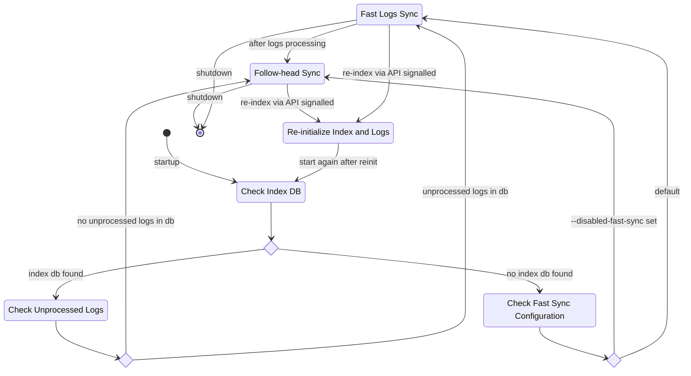

```mermaid
stateDiagram-v2
    direction TB

    fsync: Fast Logs Sync
    hsync: Follow-head Sync
    reinit: Re-initialize Index and Logs
    check_index_db: Check Index DB
    check_logs_unprocessed: Check Unprocessed Logs
    check_option: Check Fast Sync Configuration

    state if_disabled_fast_sync <<choice>>
    state if_logs_unprocessed <<choice>>
    state if_no_index_db <<choice>>

    [*] --> check_index_db: startup

    check_index_db --> if_no_index_db
    if_no_index_db --> check_logs_unprocessed: index db found
    if_no_index_db --> check_option: no index db found
    check_option --> if_disabled_fast_sync
    if_disabled_fast_sync --> hsync: --disabled-fast-sync set
    if_disabled_fast_sync --> fsync: default
    check_logs_unprocessed --> if_logs_unprocessed
    if_logs_unprocessed --> hsync: no unprocessed logs in db
    if_logs_unprocessed --> fsync: unprocessed logs in db

    fsync --> hsync: after logs processing
    hsync --> reinit: re-index via API signalled
    fsync --> reinit: re-index via API signalled
    reinit --> check_index_db: start again after reinit

    hsync --> [*]: shutdown
    fsync --> [*]: shutdown
```
