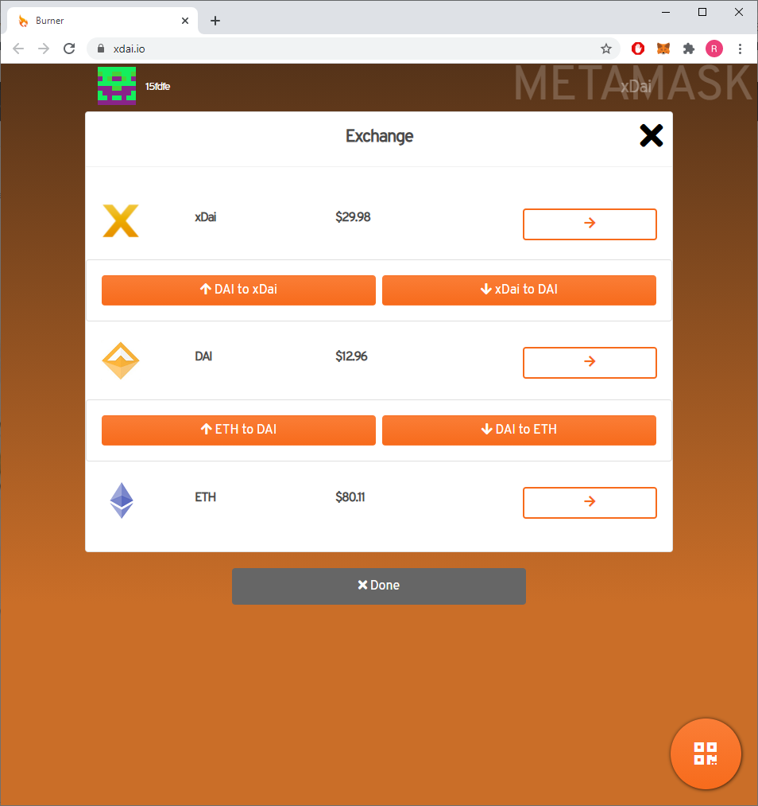

<!-- ---
description: Funding your node with xDAI to participate in the testnet
--- -->

# Funding Your Node


HOPR Säntis has ended. Thank you to everyone who participated. We'll be launching a new testnet soon, codenamed Basòdino. Check back soon for more updates.


The Säntis testnet is being hosted on xDAI Chain, a sidechain of Ethereum. In order to participate in the testnet, you'll need to fund your node with 0.02 xDAI.

First, you'll need to load some ETH into your Ethereum wallet. [MetaMask](https://metamask.io/) is one of the most widely supported wallets, but there are other options.

Next, you'll need to convert some ETH into xDAI. There are several tools you can use to do this. The simplest is to connect your wallet to the tool at [xdai.io](https://xdai.io), where you can swap ETH to DAI and then DAI to xDAI.

Finally, you'll need to send some xDAI to your node. Because xDAI is a separate chain, you'll need to change the network settings in MetaMask. [The xDAI docs have a step-by-step guide for this](https://www.xdaichain.com/for-users/wallets/metamask/metamask-setup).

Once you've sent xDAI to your node, restart **HOPR Chat** or your **HOPR PC Node**. When your node restarts, your balance will be automatically detected and you can proceed to the [registration stage](coverbot.md).

Later, you can check your balance by typing `balance`\(because the HOPR mainnet will run on the Ethereum mainchain, you'll currently see your balance described as ETH rather than xDAI\).
