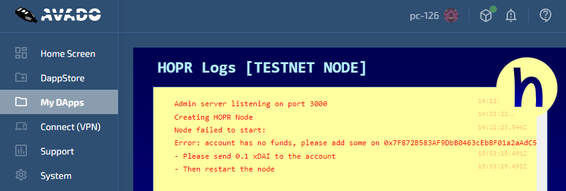
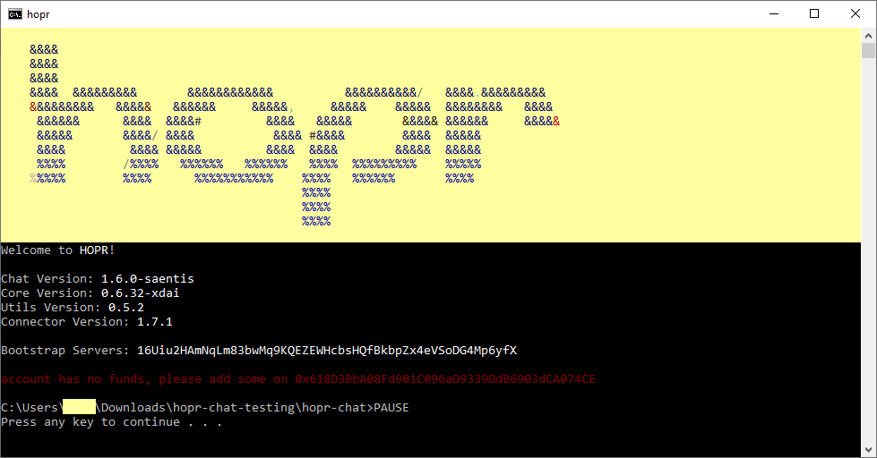

<!-- ---
description: Getting started with Säntis
--- -->

# Säntis for Previous Users


HOPR Säntis has ended. Thank you to everyone who participated. We'll be launching a new testnet soon, codenamed Basòdino. Check back soon for more updates.


If you've already run HOPR Chat before, you can connect to Säntis in no time.


If this is your first time using HOPR Chat, you'll need to install node.js or Docker. we recommend following the [HOPR Chat Quickstart Guide](https://docs.hoprnet.org/home/getting-started/hopr-chat/quickstart) to do this.


### Step 1: Connect to the HOPR Network

To start using the testnet and making your way up the leaderboard, you'll need to register your HOPR node with our bot, which will then be able to track your score and send you xHOPR tokens for relaying data.

There are two ways to connect to the testnet:

- With the HOPR Chat app
- Using a HOPR Node PC or other hardware node

#### Connecting Using HOPR Chat

To connect using HOPR Chat, you'll need to download the latest version.



[Download the latest Windows release](https://github.com/hoprnet/hopr-chat/releases/download/v1.13.0-saentis.testnet/hopr-chat-nodebin-windows.zip)



[Download the latest MacOS release](https://github.com/hoprnet/hopr-chat/releases/download/v1.13.0-saentis.testnet/hopr-chat-nodebin-macos.zip)



[Download the latest Linux release](https://github.com/hoprnet/hopr-chat/releases/download/v1.13.0-saentis.testnet/hopr-chat-nodebin-linux.zip)



**Connecting Using a HOPR Node PC**

If you have a HOPR Node PC, it should automatically updated to the latest version of HOPR Säntis. All you have to do is fund your node, as explained in the next section, and then restart.


The node will ask you to send 0.1 xDAI to your account. This is a typo. You only need to send 0.02 xDAI. Apologies, and we'll update this in the next version.


### Step 2: Fund Your Node

Next, you need to send xDAI to your HOPR node. You currently need 0.02 xDAI in your node address to participate in the testnet. If your node doesn't have enough xDAI, HOPR Chat will not start.


xDAI is a USD stablecoin, so 0.02 xDAI is worth around 2 cents. It costs xDAI to open payment channels and perform certain other testnet actions, but 0.02 is more than enough.


If your node is unfunded, you can find your xDAI address by simply starting the HOPR Chat client. HOPR Chat will recognize that your node is unfunded, and won't proceed. It will tell you your address, so you can send xDAI. Once your node is funded, you can find your address by typing `address`.

If you need more instructions on how to buy and send xDAI, see the next section: **Funding Your Node**

Otherwise, please proceed to the [**CoverBot**](coverbot.md) section.


We're working on allowing withdrawals from your HOPR node, but for now you should consider the xDAI you send to your node irretrievable. We don't recommend sending more than the minimum xDAI to your node. Having more will not affect your score or the rate at which you receive xHOPR.

