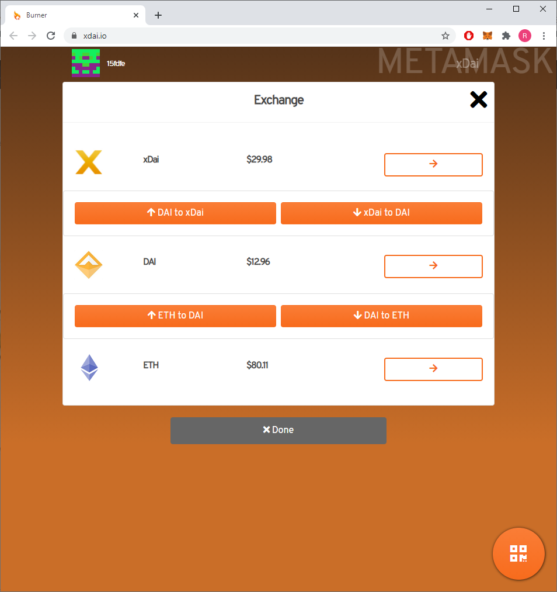

<!-- ---
description: Funding your node with xDAI
--- -->

# Funding Your Node

HOPR testnets run on Binance Chain, a sidechain of Ethereum. In order to participate in the testnet, you'll need to fund your node with 0.02 BNB.

First, you'll need to load some ETH into your Ethereum wallet. [MetaMask](https://metamask.io/) is one of the most widely supported wallets, but there are other options.

Next, you'll need to convert some ETH into BNB. There are several tools you can use to do this. The simplest is to connect your wallet to the tool at [binance.org](https://www.binance.org/ru/bridge), where you can swap ETH to BNB.

<!-- @TODO: update image -->



Finally, you'll need to send some BNB to your node. Because BNB is a separate chain, you'll need to change the network settings in MetaMask. [The BNB docs have a step-by-step guide for this](https://docs.binance.org/smart-chain/wallet/metamask.html).

Once you've sent BNB to your node, restart **HOPRd** or your **HOPR PC Node**. When your node restarts, your balance will be automatically detected and you can proceed to the [registration stage](coverbot.md).

Later, you can check your balance by typing `balance`.

To withdraw funds from your node, use the `withdraw` command. test

````eval_rst
.. content-tabs::

    .. tab-container:: tab1
        :title: Withdrawing BNB

        To withdraw xDAI, simply specify the amount and the destination address. Because HOPR is designed to run on Ethereum, you need to type ETH as the currency parameter.

        ```text
        withdraw [amount] ETH [ETH address]
        ```

    .. tab-container:: tab2
        :title: Withdrawing HOPR

        To withdraw HOPR, you'll need to add HOPR to your wallet so it can recognise your balance. The smart contract address is: 0x12481c3Ed97b32D94E71C2039DBC44432ADD39a0

        To withdraw, type:

        ```text
        withdraw [amount] HOPR [ETH address]
        ```
````
