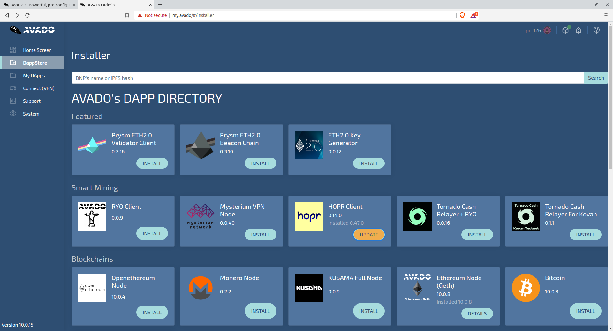

<!-- ---
description: Getting started with a HOPR AVADO Node
--- -->

# Setting Up Your AVADO Node

## Installing Your AVADO Node

To install your AVADO Node, follow the instructions which came in the box. If you have a HOPR PC Node, it will come with HOPR pre-installed. This will be an old version, but it should auto-update when you first connect.

If you have another type of AVADO Node, you'll need to install the HOPR dApp. Visit the dApp Store in the left-hand menu of your AVADO dashboard and click HOPR Client.

## **Connecting to HOPR**

If you have an AVADO Node, it should automatically update to the latest public version of HOPR. After updating, all you have to do is fund your node, as explained[ **in the next section**](funding-your-avado-node.md), and then restart.


If you've been invited to test a development build using your AVADO node, select the DappStore in the left-hand menu of your AVADO dashboard and paste the IPFS hash into the search bar. You will see an option to update your HOPR dApp. Click it, and wait for it to install.

