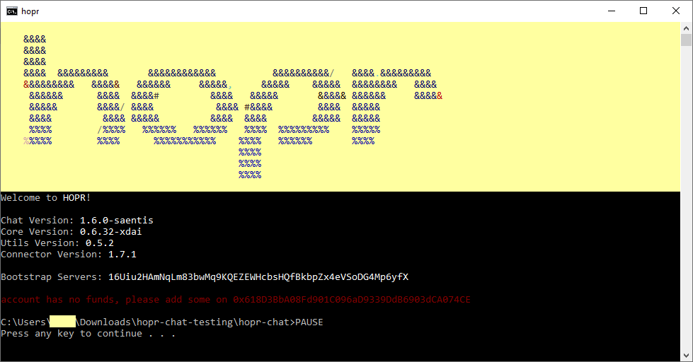

# Funding Your Node

Next, you need to send tokens to your HOPR node. To use HOPR, you'll need two types of token:

- a HOPR token
- the native token of the blockchain the HOPR token is linked to

In our current testnet, the native token is MATIC and the HOPR token is hosted on the Matic Network.


Although the testnet replicates many mechanisms from our eventual mainnet, it’s important to stress that **the testnet HOPR token on Matic is not our final HOPR token**. It’s completely separate, and can’t be bought or sold or transferred for HOPR. It’s just for this testnet, and has no value. HOPR prizes will be issued after the HOPR mainnet launch on Ethereum.


You currently need 0.02 MATIC in your node address to participate in the testnet. If your node doesn't have enough MATIC, HOPR Chat will not start.


It costs MATIC to open payment channels and perform certain other testnet actions, but 0.02 should be more than enough.


If your node is unfunded, you can find your MATIC address by simply starting the HOPR Chat client. HOPR Chat will recognize that your node is unfunded, and won't proceed. It will tell you your address, so you can send MATIC. Once your node is funded, you can find your address by typing `address`.



You can ask for MATIC in our [**Telegram**](https://t.me/hoprnet) or [**Discord**](https://discord.gg/dEAWC4G) channels. A HOPR ambassador will be glad to fund your wallet. If you need more instructions on how to buy and send MATIC, head [**here**](../core-concepts/tokens/native-tokens.md#getting-xdai).


Currently, HOPR Chat doesn't always notify you if an action has failed due to lack of funds. So if things aren't behaving as expected use `balance` to check you aren't low on MATIC. More notifications will be added in future versions.


Once you've sent MATIC to your node, restart **HOPR Chat** or your **HOPR PC Node**. When your node restarts, your balance will be automatically detected and you can proceed.

Later, you can check your balance by typing `balance`. Your MATIC balance will be displayed under `native`.

## Getting HOPR

There are two ways to get HOPR on your node: sending it directly to the node address or earning it by relaying data and redeeming tickets. Once you register with the CoverBot later in this tutorial, you will start to earn tickets by relaying data. These tickets can then be redeemed for HOPR.

To learn more about earning HOPR by relaying data, see the sections on [**Multi-hop messages**](opening-and-closing-payment-channels.md) and [**Tickets**](redeeming-tickets.md).

## Checking Your Balance

You can check your balance by typing `balance`. You'll see something like this:

```text
> balance
HOPR Balance:   0.004 HOPR
Matic Balance:  0.019932839 Matic
```

## Withdrawing Funds

To withdraw funds from your node, use the `withdraw` command.



To withdraw MATIC, simply specify the amount and the destination address. You'll need to specify `native` to show you want to withdraw MATIC rather than HOPR.

```text
withdraw [amount] native [MATIC address]
```




To withdraw HOPR, you'll need to add HOPR to your wallet so it can recognize your balance. The smart contract address is: 0x12481c3Ed97b32D94E71C2039DBC44432ADD39a0

To withdraw, type:

```text
withdraw [amount] HOPR [ETH address]
```



