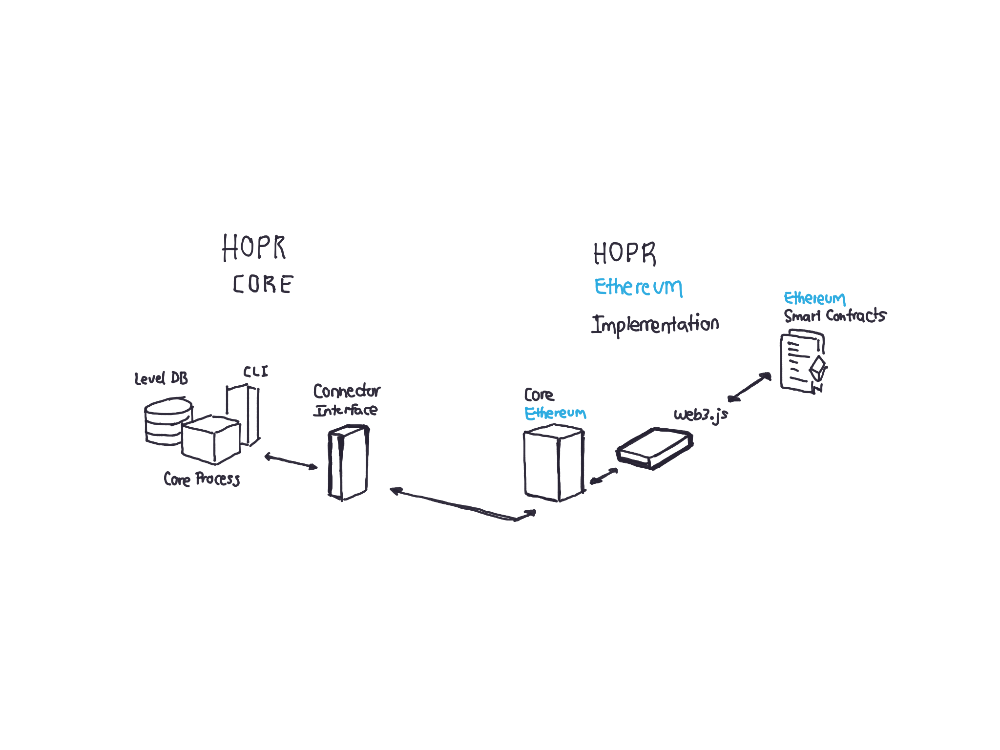

```eval_rst
.. DANGER::
   These docs are currently being updated to reflect major changes to our software since our last release. In the meantime, you can visit our `github <https://www.github.com/hoprnet/hoprnet>`_ for basic instructions on how to install and run a node.
```

# Overview

The HOPR ecosystem is a two-platform network with dynamic components powering its communication and incentivization mechanisms.

In one side, we have the **HOPR Core,** the privacy-networking module able to communicate and transfer messages securely. In the other side, we have a **Payment Gateway**, which is a Distributed Ledger Technology \(DLT\) or Blockchain infrastructure able to open payment channels on behalf of nodes running in the HOPR Network.

In its first implementation, HOPR relies on the **Ethereum Blockchain** as its first payment gateway using **Ethereum Smart Contracts.** Using Ethereum Smart Contracts**,** we can open **State Channels** on behalf of the relayers while forwarding messages. Senders of the messages then attach **\$HOPR** tokens in their messages, which upon successful delivery, are deducted and paid to the relayers involved.

To implement this process, a HOPR node implements a **Connector Interface** that communicates to the Ethereum network using its popular web library, **Web3.js.** These interfaces allow HOPR nodes to monitor, approve, sign and verify when a message is transfered, and thus close a State Channel and get their \$HOPR earned. Each node verify each other, avoiding foul play and rewarding only **Honest Relayers**.



Although the first interaction of the HOPR network is on the Ethereum network, HOPR is by design **Chain Agnostic,** which means that HOPR nodes can eventually implement different payment channels in different Blockchains. At the time of writing, HOPR is also able to implement a [Polkadot-enabled payment gateway.](https://github.com/hoprnet/hopr-polkadot)

```eval_rst
.. toctree::
   :maxdepth: 1
   :caption: Getting Started

   getting-started/README.md
   getting-started/hoprd.md
   getting-started/funding-your-node.md

.. toctree::
   :maxdepth: 1
   :caption: HOPR AVADO Node Tutorial

   hopr-avado-node-tutorial/setting-up-your-avado-node.md
   hopr-avado-node-tutorial/funding-your-avado-node.md
   hopr-avado-node-tutorial/finding-your-address.md
   hopr-avado-node-tutorial/talking-with-randobot.md
   hopr-avado-node-tutorial/registering-with-coverbot.md
   hopr-avado-node-tutorial/redeeming-tickets.md
   hopr-avado-node-tutorial/changing-your-routing-settings.md
   hopr-avado-node-tutorial/sending-a-multi-hop-message.md
   hopr-avado-node-tutorial/withdrawing-funds.md

.. toctree::
   :maxdepth: 1
   :caption: Core Concepts

   core-concepts/overview.md
   core-concepts/protocol-network-token.md
   core-concepts/hoprd/README.md
   core-concepts/hoprd/troubleshooting.md
   core-concepts/proof-of-relay/README.md
   core-concepts/proof-of-relay/routing-settings.md
   core-concepts/bootstrap-nodes.md
   core-concepts/cover-traffic.md
   core-concepts/tokens/README.md
   core-concepts/tokens/native-tokens.md
   core-concepts/tokens/hopr-tokens.md
   core-concepts/payment-channels.md
   core-concepts/tickets.md

.. toctree::
   :maxdepth: 1
   :caption: Resources

   resources/glossary.md
   resources/releases.md

.. toctree::
   :maxdepth: 1
   :caption: Community

   community/hopr-games/README.md
   community/hopr-games/bounties/README.md
   community/hopr-games/bounties/bouncer-bot.md
   community/past-testnets/README.md
   community/past-testnets/saentis-testnet.md
   community/past-testnets/basodino-testnet-runs-20th-oct-4th-nov/README.md
   community/past-testnets/basodino-testnet-runs-20th-oct-4th-nov/prize-fund-and-scoreboard.md
   community/past-testnets/basodino-testnet-v2-runs-9th-nov-23rd-nov.md

.. toctree::
   :maxdepth: 1
   :caption: QA

   qa/testing-hopr/README.md
   qa/testing-hopr/filling-a-qa-checklist.md
```
