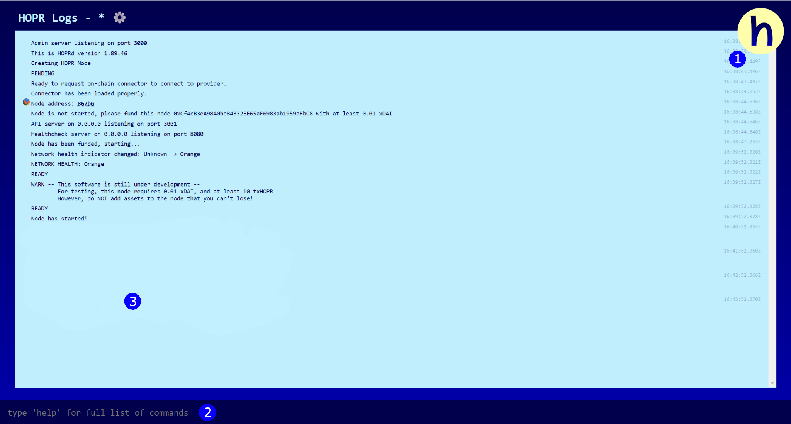

The familiar hopr-admin from previous testnets, click on any of the URLs to open the admin, then wait ~20s for the screen to turn from yellow to blue. You should end up with the following interface:

(**1**) You can click this to see a list of your connected peers; this should be the four other nodes on your cluster.

(**2**) Here you can type commands to interact with hopr-admin.

(**3**) And your output will be visible here.

Playground comes with the added benefit of having all five nodes fully interconnected. So you will be able to interact with the other nodes on your cluster without limit. You can also open multiple nodes and view the interactions from multiple perspectives. This is a good way to approach the [hopr-admin tutorial](/node/using-hopr-admin).

**Note:** You may want to close channels to recreate incomplete paths if following the tutorial.

Otherwise, take a look at the [hopr-admin commands](/node/hoprd-commands) or type 'help' in the command line to get started.
