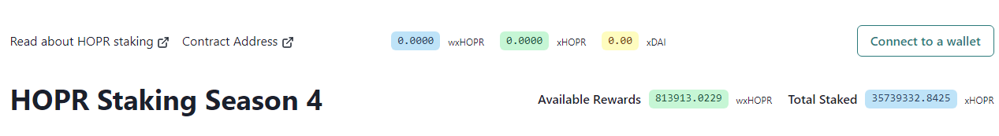
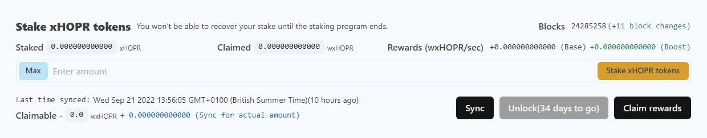
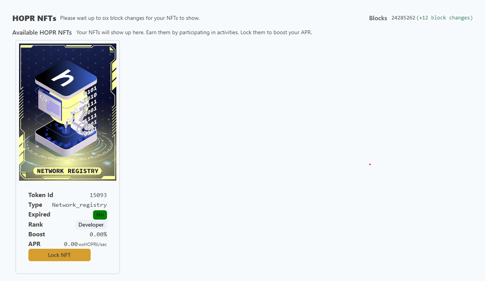
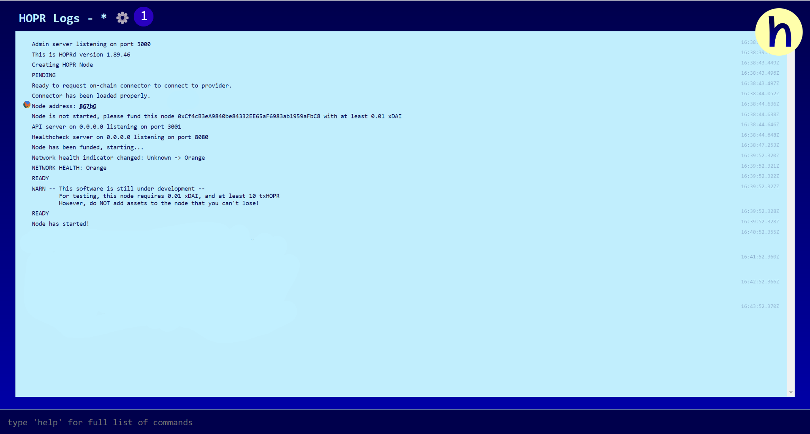
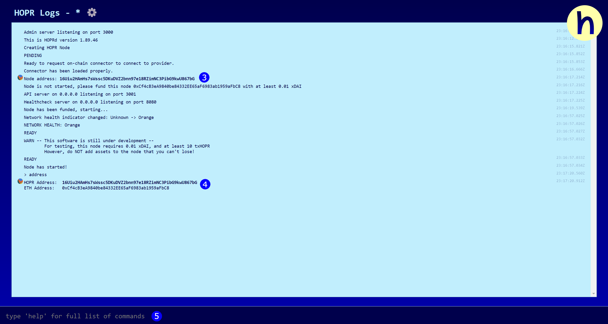
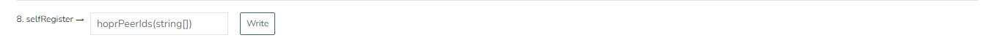
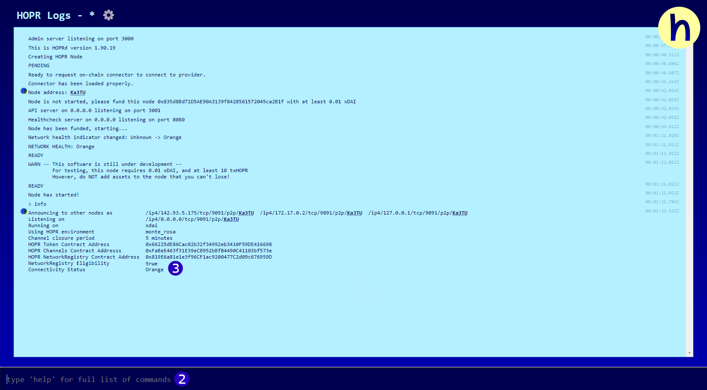

## What is the Network Registry?

The Network Registry is a list of nodes allowed to interact with others on the network. This is a utility used by HOPR to scale and test the network at a controlled pace.

This restriction on the access guarded by the "Network Registry" is only enabled in the staging or production environment by default. If you run a cluster of HOPR nodes locally in the hardhat network, the "Network Registry" is not enabled.

## Monte Rosa Release

The Network Registry is being used for the Monte Rosa release, so please make sure you are eligible and have been registered before trying to use this environment. To add your node to the registry, you must first register your interest to participate in the release by completing [this form.](https://docs.google.com/forms/d/1Vl5tD0Fy0Vrm3oxxjGepVAiq-HQU3kWDJEuk35jpjeY/edit)

The staking address you provide on this form will be the primary indicator of your eligibility to be added to the registry.

## Eligibility

From the list of interested participants, an ordered waitlist will be generated. Your rank on the waitlist is determined by the NFTs held in your staking address from past testnets/staking seasons and how much HOPR you have staked currently.

Users from the waitlist will then be given an NFT in blocks of 20. You can use this NFT to register your node on the network registry smart contract.

For every 20 NFTs given out, the majority will go to the next highest-ranking participants on the waitlist, but a few will also be allocated to Dappnode/Avado users. And one of every 20 will be given to someone at random further down the waitlist (so you always have a chance of being chosen even without having participated in previous staking seasons or releases).

Depending on your prefered method of contact, you will either be notified by email when you have been chosen or you can review the waitlist manually here.

## Registering your node

If you are chosen to join the registry, you will be sent a network registry NFT to your staking address as well as mHOPR and xDAI to fund your node. You will be contacted to confirm your eligibility. Once you have been sent an NFT and a confirmation, you can register your node by following these steps:

### Step 1: Stake your NFT

(**1**) Go to [stake.hoprnet.org](https://stake.hoprnet.org/)

(**2**) Connect your wallet (make sure this is the one containing your NFT). You should see an icon for this on the top right of the site. Once you have connected your wallet, you should see the option to 'Sync'.

(**3**) Click the sync icon.

(**4**) You should now see your Network Registry NFT under available HOPR NFTs

(**5**) Click Lock NFT

(**6**) Then click sync again and make sure your NFT now appears under 'locked HOPR NFTs'.

### Step 2: Get your peerID

To continue, you first need to have installed a HOPR node. You can use one of the following three methods to do so:

- [Using Avado](./using-avado.md)
- [Using Dappnode](./using-dappnode.md)
- [Using Docker](./using-docker.md)

If you do not have an Avado or Dappnode, use Docker to install the node on your device.

Continue here once you have installed a node and can see the hopr-admin interface.

#### Hopr-admin interface

You should be greeted with a screen similar to the one below, if your screen is yellow and asks you to check your settings, you need to check your security token and API endpoint. You can do this by:

(**1**) Clicking on the gear icon. This will open a pop-up similar to the one below.

(**2**) From here, make sure you have the correct information. By default, `API endpoint` should be set to `http://localhost:3001`, but you may need to replace `localhost`with your server IP address if you used a VPS and change the port if you adjusted the mapping on installation.

If you are using an Avado or Dappnode then the endpoints are `http://hopr.my.ava.do:3001` and `http://hopr.dappnode:3001` respectively.

The`API Token` is whatever you set your security token as in the installation process.

(**3**) From the admin interface, you should be able to see the peerID labelled as node address. Click on this contracted 5-letter address to expand it to its full length and copy it.The address should look similar to this: `16Uiu2HAmMBYpQVq7rfFxV5iP3JPXJKs1dqRe2Z6HX7zXJgwjTzjV`.

(**4**) Alternatively, you can type ‘address’ into the command line.

(**5**) your peerID will be outputted as your `HOPR address`.

At this point, you should have the peerID of the node you want to register copied and your network registry NFT staked. Keep the admin interface open. You will need it to confirm your registration later.

### Step 3: Registering your peerID

(**1**) Go to [the smart contract on blockscout](https://blockscout.com/xdai/mainnet/address/0x819E6a81e1e3f96CF1ac9200477C2d09c676959D/write-contract#address-tabs)

Scroll down and make sure you are on the **write contract** tab.

(**2**) Connect the wallet which you used to stake your NFT

(**3**) Locate the 8th function. It will be named `selfRegister`

(**4**) In the text field, paste your peerID

(**5**) Click ‘Write’ and confirm the transaction if your wallet gives you a prompt.

If you have connected a wallet which has staked an NFT and entered a valid peerID, this transaction should succeed. You can find your block confirmation on Blockscout.

If it fails, make sure you:

- Have entered the correct peerID
- Have staked your NFT
- Are connected to this contract using the same wallet you staked your NFT with

If all of the above is true and the transaction still fails, message us on [telegram](https://t.me/hoprnet), and a member of our team will assist you.

### Step 4: Confirm your registration

Once the transaction has successfully been completed, you can use the hopr-admin to check you have been registered.

**Note:** you will not be registered instantly and should wait a few minutes before checking.

To check if you have been registered:

(**1**) Open the hopr-admin interface, you should hopefully have kept it open from step 2. If not, reopen it.

(**2**) Type ‘info’ into the command line

(**3**) Check that Network registry eligibility is set to ‘true’

(**4**) If it is still false, wait a few minutes and check again

The registration process is now complete! You can proceed to our [hopr-admin tutorial](using-hopr-admin).

## Monte Rosa rewards

Participants of the Monte Rosa release will be rewarded depending on their uptime. The more active and available your node is, the higher you will score. Your uptime (and score) will be measured through pings sent out by five nodes controlled by HOPR.

These five nodes will ping each node on the network registry at randomised intervals throughout the day and record whether or not the node received the ping and the latency of the ping is received. This is publicly viewable at [network.hoprnet.org](https://network.hoprnet.org/).

You can use this site to search your peerID (or any peerID on the network) and view their availability, average latency and total pings received. These metrics will be used to give each node its score and at the end of the initial release, rewards will be distributed as follows:

- Top 25% receive a diamond NFT
- 25-50% receive a gold NFT
- 50-75% receive a silver NFT
- Bottom 25% receive a bronze NFT

Each NFT gives a sizeable APR boost when [staking HOPR tokens](https://stake.hoprnet.org/), with higher ranked NFTs providing both a better APR and a better rank on future waitlists. As HOPR NFTs are often used as an indicator to decide participants for early access. So if you are not using a hardware node such as Avado or Dappnode, consider the following setups to maximise your uptime:

- Using Tmux or Screen on a VPS to run your node 24/7
- Using a machine that can remain plugged in throughout the day. E.g. avoid laptops
