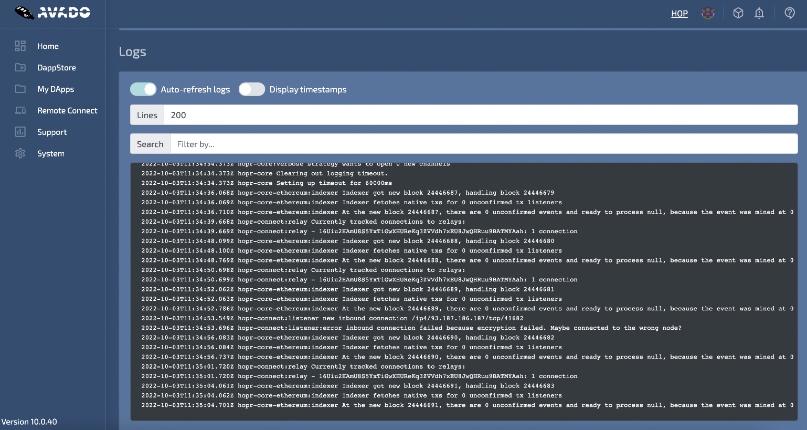

To set up your AVADO Node, follow the instructions that came with the box. If you have a HOPR PC Node, it will come with HOPR pre-installed. All you have to do is download the HOPR client to start interacting with your node!

:::caution Warning
Please withdraw all your funds and delete the old package before installing a new one.
:::

## Installing the HOPR client

While connected to your AVADO's network or via a VPN, go to the following [link](http://my.ava.do/#/installer/%2Fipfs%2FQmPhSZTZbM6kd9VizvZpKDN3fQe5bqvCDooCBPYEUXdTcy). Just click the install button and wait until the download completes.

If you are unable to use the link above, search for this hash in the AVADO DappStore:

```
/ipfs/QmTjYk8f8SXyTKy8W9skPtKmx5FnV3oVHDegqPio1FtdoS
```


After you have installed the HOPR package, you can find the HOPR client in `my DApps`.


Your **security token** is set to `!5qxc9Lp1BE7IFQ-nrtttU`. You will need this to access the hopr-admin.

If you are in the process of registering your node on the network registry, please complete the process [here](./network-registry-tutorial.md) before continuing.

Otherwise, the installation process is complete! You can proceed to our [hopr-admin tutorial](using-hopr-admin).

## Collecting Logs

If your node crashes, you will want to collect the logs and pass them on to our ambassadors on telegram or create an issue on GitHub. 

To collect the logs:

(**1**) Locate your HOPR package and click on the manage icon.


(**2**) Scroll to the bottom to find your logs.



(**3**) Enter 1500 into the `Lines` text field instead of 200 and turn `auto-refresh logs` off. Now you should be able to copy your logs easily.

With your copied loges either:

- Save them in a .txt file and send them to an ambassador on our [telegram](https://t.me/hoprnet) for assistance. 
- Or, create an issue using our bug template on [GitHub.](https://github.com/hoprnet/hoprnet/issues) 
