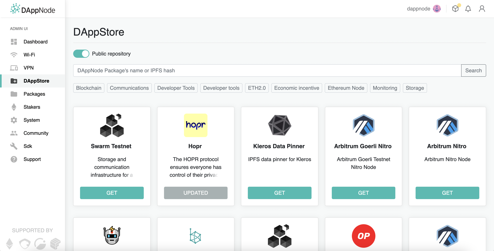
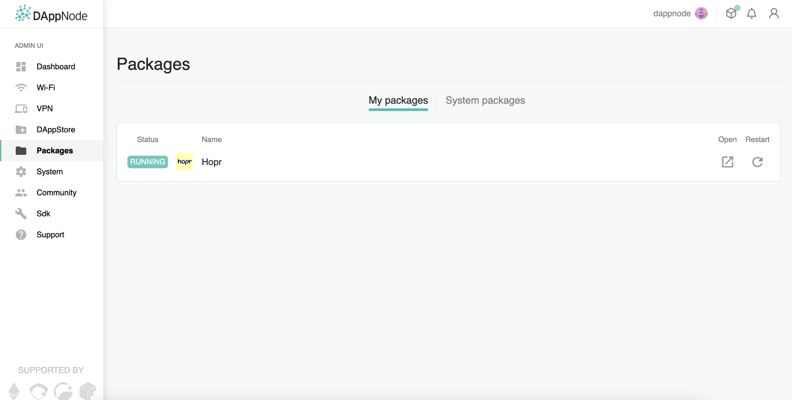
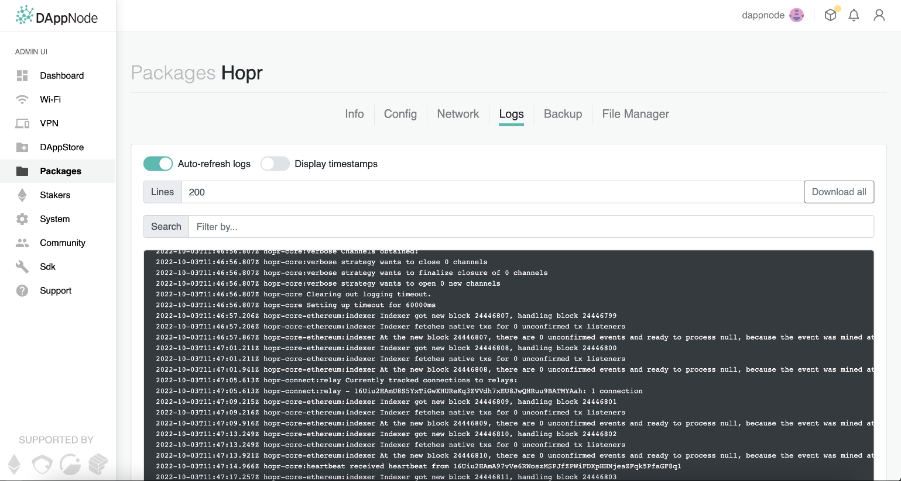
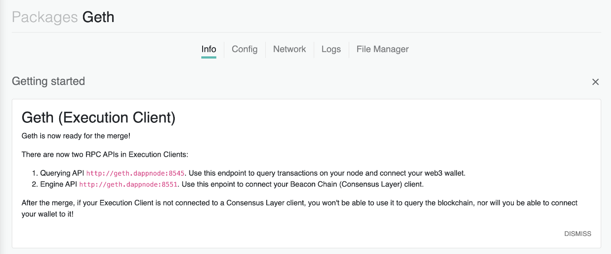
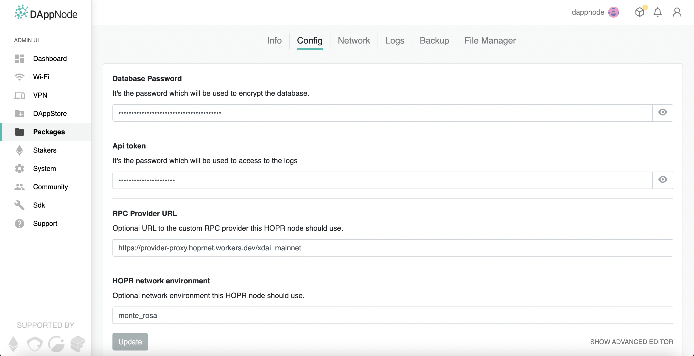

To set up your DAppNode, follow the instructions that came with the box. Then, just install the HOPR client and you can start using your node right away!

:::caution Warning
Please withdraw all your funds and delete the old package before installing a new one.
:::

## Installing the HOPR Client

(**1**) Open the DAppStore using the sidebar to the left and enter the following hash into the search bar:

```
/ipfs/QmaGNSnRHduxb98FzZULnN9cuQTChybAUXdTw6Pza1b958
```



(**2**) It should bring up the latest version of the HOPR client. Click **Get** and wait for the download to complete.

That's all! You should now be able to find the HOPR client in your 'Packages'.



Simply, open the client and you should be greeted with the hopr-admin interface.

Your **security token** is set to `!5qxc9Lp1BE7IFQ-nrtttU`. You will need this to access hopr-admin.

If you are in the process of registering your node on the network registry, please complete the process [here](./network-registry-tutorial.md) before continuing.

Otherwise, the installation process is complete! You can proceed to our [hopr-admin tutorial](using-hopr-admin).

## Collecting Logs

If your node crashes, you will want to collect the logs and pass them on to our ambassadors on telegram or create an issue on GitHub.

To collect the logs:

(**1**) Find HOPR in your packages and navigate to the backup section.



(**2**) From there, all you have to do is click 'Download all'.

Using the downlaoded file either:

- Send it to an ambassador on our [telegram](https://t.me/hoprnet) for assistance.
- Or, create an issue using our bug template on [GitHub.](https://github.com/hoprnet/hoprnet/issues)

## Using a Custom RPC Endpoint

You can set your own RPC endpoint for HOPR to use. Ideally, you would install an ETH client on your DAppNode and use its local provider. A local provider helps increase decentralisation and is generally good practice, but you can also use any RPC provider of your choice.

### Finding your local endpoint

If you have already installed an ETH client, you can find its RPC endpoint on the package's info page.



The image above shows the RPC endpoint for the GETH client (querying API in the image): `http://ethchain-geth.my.ava.do:8545`. Your endpoint will be different depending on the client you have installed. Otherwise, you can use any non-local RPC provider such as [ankr.](https://www.ankr.com/)

### Changing your RPC endpoint

To change your RPC endpoint:

(**1**) Find HOPR in your packages and navigate to the 'Config' section.



(**2**) Paste your custom RPC endpoint in the text field under `RPC Provider URL`.

(**3**) Click 'Update' and wait for your node to restart.

All done! Your DAppNode node will now use your specified RPC endpoint.
