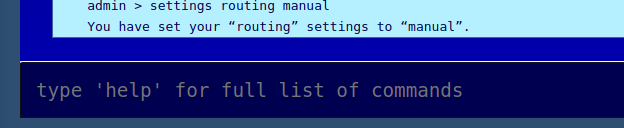

# Changing Your Routing Settings

Messages sent through the HOPR network take a certain number of "hops" before reaching their destination. These hops via nodes like yours are what obscures the data and metadata from outside observers. Each hop costs a small fee. These fees are charged in xHOPR, and a paid by the previous node in the chain to the next node. However, this fee cannot be claimed until the data has been successfully passed to the _next_ node in the chain. This is called **proof-of-relay**, and it's how HOPR ensures data reaches its destination without revealing information about the sender, recipient, or the route the data takes.

As a user, you can specify how many hops your data will make before it reaches its destination. You also specify the route it will take \(later versions will implement automatic routing, so you only need to specify the number of hops you want\).  
  
You can choose zero hops. This is called direct routing, and the data is sent straight to the recipient. This doesn't cost HOPR tokens, but it also doesn't have any privacy benefits, so it is not recommended.  
  
In the testnet, routing is set to direct by default. So to start testing HOPR's multihop features, we need to turn that off.

### Change Routing to Manual

Type:

```text
settings routing manual
```

You'll see the following notification:



You can check your routing settings at any time by typing `settings`.

