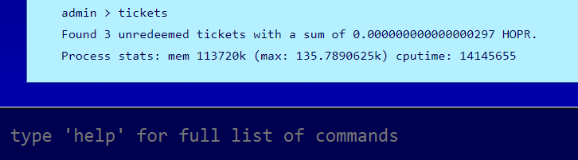
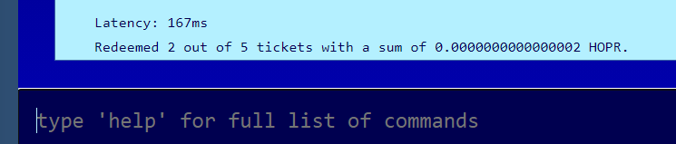

# Earning and Redeeming Tickets

The HOPR private mixnet is kept secure using proof-of-relay. This mechanism ensures that nodes do not receive payment until they have completed their relaying duties.

When you receive data to relay from an upstream node, it will be accompanied by half of an encrypted payment key. You will only receive the second half when you relay the data to the next node in the chain. Once you have both halves of the payment key, they are automatically combined to form a **ticket**. These tickets can be redeemed for HOPR tokens \([**xHOPR**](../core-concepts/tokens/hopr-tokens.md) in our testnets\).

To seem how many tickets you currently have, type:

```text
tickets
```



To redeem your tickets, type:

```text
redeemTickets
```

This will redeem all of your tickets. The testnet HOPR from these tickets will be added to your balance. You'll get a notification as each ticket is redeemed, liked this:




Redeeming tickets requires calling the HOPR smart contract, so can take some time. You will be notified as each ticket is redeemed.



Redeeming tickets requires calling the HOPR smart contract, so will incur a small fee in the native currency. Make sure you have enough in your `balance` to complete this action.


