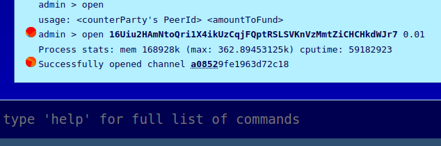
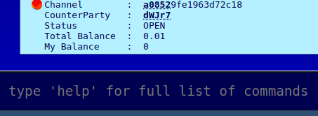

# Sending A Multi-hop Message Using A Payment Channel

When you send data via HOPR, there needs to be an open and funded payment channel between every two nodes in the route \(except the penultimate node and the recipient\). For example, if we send a message from Alejandro to Zoe via Betty, Chao and Dmitry, there needs to be three open funded channels: between Alejandro and Betty, Betty and Chao, and Chao and Dmitry.  
  
This is because HOPR is an incentivized mixnet, and users need to be able to prove they have the funds available to send data. \(Also, opening and closing payment channels happens on the blockchain, which takes time. It's not possible to open payment channels on demand and still send data quickly.\)


Payment channels need to be funded with HOPR tokens. Before we proceed, make sure you have xHOPR in your node. You can type `balance` to check.   
  
These xHOPR won't be spent \(RandoBot has no way to redeem tickets to claim xHOPR\), but you still need to stake them in the channel. To get xHOPR, ask in our Telegram or Discord channel. Remember you need to send to you wallet \(xDAI\) address, not the HOPR address.


### Open A Payment Channel To RandoBot

To open a payment channel on your AVADO node, you need to type `open`, followed by the address of the node you want to open the channel to, followed by the amount of xHOPR you want to fund the channel with.  
  
So to open a channel to RandoBot and fund it with 0.01 xHOPR, type:

```text
open 16Uiu2HAmNtoQri1X4ikUzCqjFQptRSLSVKnVzMmtZiCHCHkdWJr7 0.01
```

This can take a few seconds to work, because your node will need to interact with the HOPR smart contract. Once it does, you'll see a notification that the channel has been opened, along with a receipt.




You can verify any of the receipts you get on an xDAI block explorer. For example: [https://blockscout.com/poa/xdai/](https://blockscout.com/poa/xdai/)


Type `balance`, and you'll see that your xHOPR balance has reduced by the amount you funded the channel with. Your xDAI balance will also have slightly decreased. This is the fee for opening the payment channel.

### Check Your Channel Status

You can check on your payment channels by typing `openChannels`.



### Send A Multi-Hop Message

Now let's send your first multi-hop message! We'll send it from your node, via randobot, and back to your node. Find your address using `myAddress`. Then type `send <your address> <intermediate node> <your message>`.


To make this simpler, you can also set an alias for your own address. For a refresher on aliases, visit [**this page**](talking-with-randobot.md#step-3-set-an-alias).



###    

