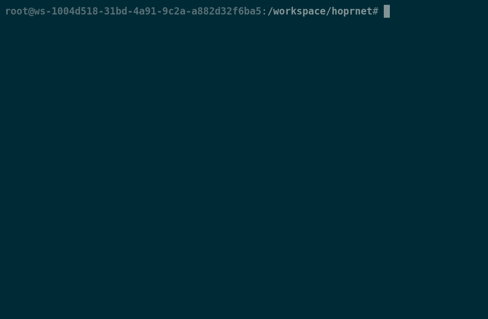

# Using NPM

The NPM setup allows you to install and run **HOPRd** as a Nodejs application, ensuring your experience is a close as to the developer’s have when developing **HOPRd** and the **HOPR Core** protocol. Nodejs might require further software installation, but is able to be run in less hardware demanding machines, while taking considerable less space in comparison to Docker \(i.e. 50mb\).

## Installing NPM

In order to get NPM on your machine, you will need to install Nodejs, our recommended way of doing this is to install [nvm](https://github.com/nvm-sh/nvm) / [nvm-windows](https://github.com/coreybutler/nvm-windows), a Nodejs version manager. This ensures we can install and uninstall as many versions of Nodejs as needed. Furthermore, it will help you installing any additional requirements \(if any\) for running Nodejs.

```eval_rst
.. content-tabs::

    .. tab-container:: windows
        :title: Windows

        `Windows Guide <https://github.com/coreybutler/nvm-windows#install-nvm-windows>`_

    .. tab-container:: linux_macos
        :title: Linux or macOS

        `Linux & macOS Guide <https://github.com/nvm-sh/nvm#installing-and-updating>`_
```

_Please bear in mind you might need to restart your terminal after running these commands._

## Installing Nodejs

After you have downloaded and setup nvm in your machine \(run `nvm ls` to ensure everything is in place\), now you need to install a specific version of Nodejs before running **HOPRd**.

At the time of writing, **HOPRd** runs on Nodejs `v14`. Specifically, **HOPRd** has been developed and tested in `v14`, so in case you run on any issues with **HOPRd,** try switch to `v14` to see if those issues disappear.

To install Nodejs with nvm, run the following

```bash
$ nvm install v14
$ nvm use v14
```

If everything was done properly, you can run `node --version` to see your current `node` version, alongside running basic commands as shown when running simply `node` in your terminal.



## Installing HOPRd using NPM

```bash
$ npm install --unsafe-perm=true -g @hoprnet/hoprd@1.62.13
```
