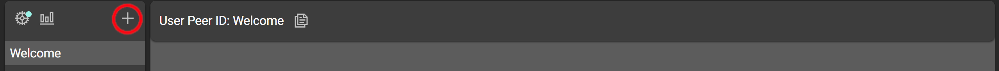
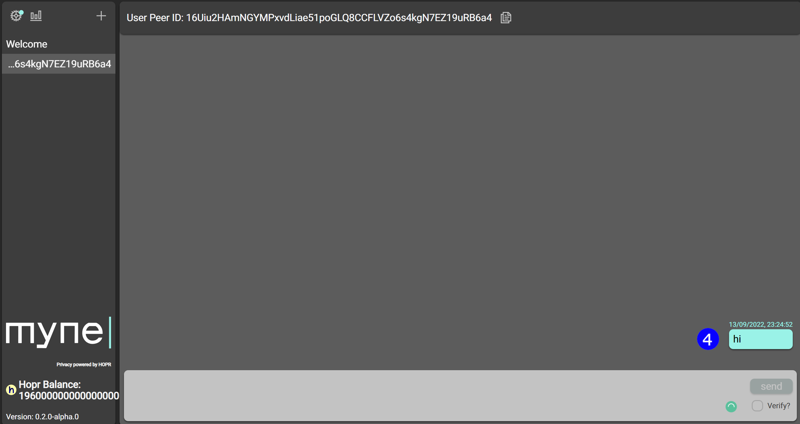
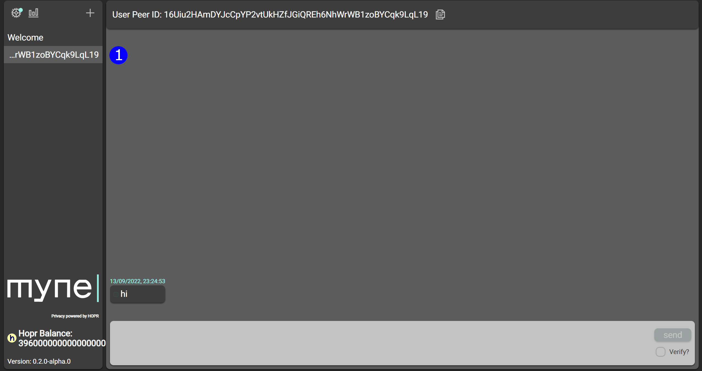

Myne Chat is a private and decentralised messaging dApp. Share links and peerIDs to start a conversation with your friends.

To start a conversation, both you and your friend both have to complete a few steps:

### Your Perspective (the host):

(**1**) Pick two nodes to use, open one, and send the other to your friend.

(**2**) Click the "+" icon on the top left.

(**3**) Copy your friend's peerID and enter it into the pop-up, then click send.

(**4**) To officially start a conversation, you have to send a message (if you don't, your friend won't see the open conversation).

### Friend's Perspective:

(**1**) Find the open conversations on the left. You can use the host's peerID to locate the one you want if you have more than one.
