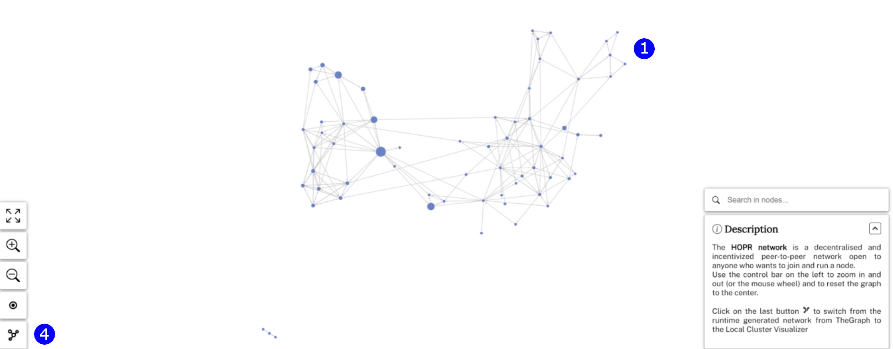

Visualizer draws a graphical representation of the HOPR network showing all the nodes and connections between them.

**Note:** The data in this app is from the Monte Rosa environment

(**1**) You can open any URL to see a graph of every node and connection on the Paleochera testnet.

(**2**) Zoom in to nodes and hover over them to see their individual connections. You can also click on these nodes' address details on blockscout.

(**3**) You can see the direction of each payment channel and the funds staked on them.

(**4**) If you click on the local cluster icon on the bottom left, you can see where your node fits into this network.

The local cluster will be empty as your current node doesn’t exist on the Paleochera testnet.
