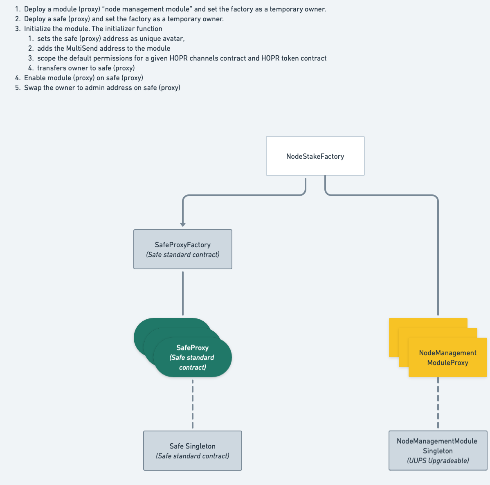

## Introduction

This documents provides an overview of the HOPR smart contracts as the basis for
the smart contracts audit in 08/2023. It describes the relevant threat model,
sets the scope, gives a high-level description of the relevant smart contracts
and their relation and ABIs. Moreover, it provides pointers to the source code
and steps on how to run tests and other operations on it.

## Scope

All HOPR smart contracts can be found in the hoprnet monorepo:

```
https://github.com/hoprnet/hoprnet
```

The Git commit hash under audit is:

```
41fa52c9c50b0029cd8329f04409b05d31eb063b
```

All smart contracts can be found within the folder:

```
packages/ethereum/contracts/src
```

For convenience, the following link points to the source folder using the
correct version:

```
https://github.com/hoprnet/hoprnet/tree/41fa52c9c50b0029cd8329f04409b05d31eb063b/packages/ethereum/contracts/src
```

Specifically, the following contracts are within the scope of the audit:

```bash
├── Channels.sol
├── Crypto.sol
├── MultiSig.sol
├── interfaces
│   ├── IAvatar.sol
│   ├── INetworkRegistryRequirement.sol
│   ├── INodeManagementModule.sol
│   └── INodeSafeRegistry.sol
├── node-stake
│   ├── NodeSafeRegistry.sol
│   ├── NodeStakeFactory.sol
│   └── permissioned-module
│       ├── CapabilityPermissions.sol
│       ├── NodeManagementModule.sol
│       └── SimplifiedModule.sol
└── utils
    ├── EnumerableStringSet.sol
    ├── EnumerableTargetSet.sol
    └── TargetUtils.sol
```

### Out of Scope

The following contracts are out of scope:

```bash
├── Announcements.sol # node announcement scheme which is independent from staking
├── Ledger.sol # snapshot-based indexing of Hopr Channels
├── NetworkRegistry.sol # implements network gate which will be removed eventually
├── TicketPriceOracle.sol # standalone oracle to change HOPR ticket price network-wide
├── proxy # implementations of adapters between network registry and staking
│   ├── DummyProxyForNetworkRegistry.sol
│   ├── SafeProxyForNetworkRegistry.sol
│   └── StakingProxyForNetworkRegistry.sol
└── static # existing contracts which will not be updated
    ├── EnumerableStringSet.sol
    ├── ERC777
    │   └── ERC777Snapshot.sol
    ├── HoprDistributor.sol
    ├── HoprForwarder.sol
    ├── HoprToken.sol
    ├── HoprWrapper.sol
    ├── HoprWrapperProxy.sol
    ├── openzeppelin-contracts
    │   ├── ERC777.sol
    │   └── README.md
    └── stake
        ├── HoprBoost.sol
        ├── HoprStake.sol
        ├── HoprStake2.sol
        ├── HoprStakeBase.sol
        ├── HoprStakeSeason3.sol
        ├── HoprStakeSeason4.sol
        ├── HoprStakeSeason5.sol
        ├── HoprStakeSeason6.sol
        ├── HoprStakeSeason7.sol
        ├── HoprWhitehat.sol
        └── IHoprBoost.sol
```

## Concepts

The HOPR protocol uses smart contracts for different concepts. The 2 relevant
concepts for this audit are the `Incentivization Mechanism` and `Staking`. Other
concepts, while using smart contracts, don't touch funds or have limited impact
on the operation of the protocol which is why they are not in the scope of the
audit.

### Staking

The higher-level goals of the staking design are (1) to decouple management of funds from the
operation of a node, (2) have the option of co-signing transactions for higher
security and (3) reduce the impact of compromised nodes on the user's funds.

Fundamentally, authorization of various actions is split amont 3 private keys.
Through this separation of concerns each private key has only a single area of
functionality where its being used which is distinct from the other keys,
reducing the surface area of attacks and making general recovery of the entire staking account easier.

#### Private Keys

Packet Key
: An ed25519 key which is used by a single node. It is generated by
the node itself at initialization of the node. The packet key is used for
HOPR packet-related cryptographic operations.

Chain Key
: An secp256k1 key which is used by a single node. It is generated by
the node itself at initialization of the node. The chain key is used for any
on-chain operation of the node. In wallet-terms it may be considered to be a
hot wallet, because the node can use it at runtime without user interaction.

Admin Key
: An on-chain EOA or smart contract wallet which is used by a user
to set up and manage their staking account.

While the packet key is primarily used in the p2p interaction of the HOPR nodes,
the chain keys and admin keys work together to safe-guard and perform actions on
behalf of a user. The exact combination of those keys and actions depends on the
security settings of a user which is described in detail later.

#### Safe

At the center each user has a `Safe`, also called `NodeSafe`, which is configured to use the custom `NodeManagementModule` module. `AdminKey`s are registered in the `NodeSafe` as owners, while `ChainKey`s are delegates. The `NodeManagementModule` implements capability permission checking for transactions which are to be executed by a `Chain Key` directly. To allow for those checks to work a `Chain Key` must be registered within the `NodeManagementModule` beforehand.


#### Deployment

The deployment of the entire initial setup is done through the `NodeStakeFactory`. It takes care of deploying and configuring the respective contracts and handing over ownership to the user at the end. The result of a complete deployment is a new `NodeSafe` which is configured to use a newly deployed `NodeManagementModule` and has the user's account set as owner.



#### Operations

As described earlier operations on payment channels can have different flow
depending on the sender of the transaction and the target of the transaction. We
distinguish between 3 flows:

1. `Admin Key`s perform operation directly through `NodeSafe`.
1. Node (`Chain Key`) can perform an operation directly via the `NodeManagementModule`.
1. Node submits transaction to `NodeSafe` as delegate, transaction is then
   signed and executed by `Admin Key`(s).

Option 1 will always work and is the fallback mechanism to recover from
compromised or lost `Chain Keys`. Its a manual interaction by the user

Option 2 is the automated flow where a node may operate autonomous and perform
on-chain operations regarding the payment channels as needed.

Option 3 is the co-signing flow, where the proposal of a transaction by a node
(a delegate of the `NodeSafe`) is considered the first signature and the `Admin
Keys` can perform the final signatures and execute the transaction. This option
can be used for high-value channels or critical operations which a user would
like to manually sign off on.

Options which involve `Chain Keys` are implemented through so called `GranularPermission` which can
be `ALLOW` to enable option 2 (however option 3 is possible too at this point) and `BLOCK` to force option 3.

The call targets for which the `NodeManagementModule` checks these permissions
are a small list of actions a node might want to perform:

- `HoprChannels.redeemTicketSafe`
- `HoprChannels.closeIncomingChannelSafe`
- `HoprChannels.initiateOutgoingChannelClosureSafe`
- `HoprChannels.finalizeOutgoingChannelClosureSafe`
- `HoprChannels.fundChannelSafe`
- `HoprToken.approve`
- `HoprToken.send`


### Incentivization Mechanism

The HOPR protocol relies on node's being paid for relaying packets. This
payment, the incentiviation, ensures nodes perform their service as best as
they can. Its realized through the novel `Proof of Relay` scheme, whereby its
cryptograhically ensured that a node has performed the relay service and may try
to get paid for it. The payment is encapsulated as a so called `Ticket` which
has a `Winning Probability`. The implementation of this uses unidirectional
payment channels between two nodes where the source node locks funds into the
channel, assuring the destination node that it can get paid out of those locked
funds when performing the relaying service. In order to get paid the destination
node presents a received ticket via the `redeemTicket` function, which may lead
to a payout of funds.

The on-chain parts of this concept are implemented in the `Channels.sol` file as
the `HoprChannels` contract.

### Proof-Of-Relay

Messages in the HOPR network are sent as packets along paths. When sending a packet, the source samples a random path and encodes it into the packet. By using the SPHINX packet format, the creator of the packet derives a shared key with each node along the path. This allows the sender to create secret sharings for adjacent nodes along the path. Once a node processes a mixnet packet, it is able to derive the first part of the secret share. The second part can be derived by the next downstream node and gets sent as an acknowledgement.

In order to claim incentives on-chain for relaying packets, nodes need to reveal the reconstructed secret which we call `porSecret`. This proves to the smart contract that a node has processed a mixnet packet and that the next downstream node has received it and considered it valid.

### Probabilistic Payments

To decouple packet processing from observable on-chain state changes when claiming the incentive for relaying a packet, the HOPR protocol makes use of probabilistic payments. This is not only beneficial for privacy reasons, it also minimizes the number of on-chain state changes.

Incentives for relaying packets are embedded in a data structure that we call "ticket". Once issued, each ticket has a winning probability, which compiles some tickets into an actual payout whereas other do not have any added value. Note that at the time a ticket is issued, it is unclear whether the ticket is a win or not. The HOPR protocol hides this information until the relayer has received the acknowledgement from the next downstream node.

The relayer then combines both key shares and derives a deterministic but pseudo-random secret using a verifiable random function (VRF) that takes the node's private key and the serial number of the ticket. The decision whether a ticket is a win thus depends on entropy from the relayer and from the creator of the packet.

In case ticket issuer and packet creator are not the same party, which applies to all relayers, the ticket issuer has no control on the conditions which turn a ticket into a win or not. To prevent the ticket issuer collusion attacks of packet creator and next downstream node, the decision whether a ticket is a win also depends on the signature of the ticket issuer over the ticket data.

### Payment Channels

By default, probabilisitic payments come with no guarantee that there are any funds to cover for a winning ticket. To still secure payments, nodes create a deposit from which the payout of a ticket gets deducted.

Within the HOPR protocol, creating such a deposit is implemented using unidirectional payment channels. The node who creates the deposit is referred to as source of the payment channel whereas the the node who claim incentives for relaying packets is called destination of the payment channel.

Each payment channel is modeled by a finite state machine with three states: `OPEN`, `CLOSED` and `PENDING_TO_CLOSE`. A payment channel with state `CLOSED` does not include any funds and thus cannot be used for claiming incentives. Once a node deposits funds in a payment channel, the channel has state `OPEN`. As long as the payment channel has state or `OPEN` or `PENDING_TO_CLOSE`, the destination of the payment channel is allowed to claim incentives for relaying packets, which we call "redeem tickets". Payment channels can be torn down in order to pull out locked funds. This can be initiated by the source and the destination of the payment channel. In case of the latter, this can happen immediately and results in the deposited fund being transferred to the source of the payment channel. On the other hand, if the source attempts to close the channel, it must be possible for the destination to redeem all their tickets as they lose their validity once the channel gets closed. For that reason, the protocol foresees a notice period in which the destination of a payment channel has the opportunity to redeem all their tickets. This state is called `PENDING_TO_CLOSE`. Once the notice period is due, the source or the destination of the payment channel can finally close the channel.

```
                                  redeemTicket()
                                     ┌──────┐
 finalizeOutgoingChannelClosure()         v      │
  (after notice period), or  ┌──────────────────────┐
  closeIncomingChannel()     │                      │ initiateOutgoingChannelClosure()
            ┌────────────────│   Pending To Close   │<─────────────────┐
            │                │                      │                  │
            │                └──────────────────────┘                  │
            v                                                          │
     ┌────────────┐      tokensReceived() / fundChannel()         ┌──────────┐
     │            │──────────────────────────────────────────────>│          │
     │   Closed   │           closeIncomingChannel()              │   Open   │
     │            │<──────────────────────────────────────────────│          │
     └────────────┘                                               └──────────┘
                                                                    │      ^
                                                                    └──────┘
                                                                  redeemTicket()
```

### Aggregatable tickets

Tickets encode a winning probability which is chosen when issuing the ticket. As not all tickets lead to an actual payout, the value of a ticket is given by the expected value, the product of winning probability and the embedded amount. Winning probability and amount should be chosen according to the usage of the data channel link between source and destination such that there is high chance to have a winning probability in a defined time interval that can be one hour.

Although the node has received a winning ticket, that ticket needs to be submitted to the smart contract and thus leads to a potentially costly state change.

To mitigate this, winning tickets can get aggregated off-chain by the ticket issuer. To do so, the ticket redeemer proves to the ticket issuer that it has received a winning ticket. Since the decision whether a ticket is a win is deterministic and only depends on the ticket, this does not reveal sensitive information to the ticket issuer. Therefore, the ticket issuer can issue a ticket with 100% winning probabilitiy worth the sum of all presented tickets.

## Threat Model

In our design we consider the following actors:

1. Node Runner: A user who is running one or many HOPR nodes and therefore
   participates in the network. A node runner is expected to be honest, but
   greedy to the extend where the HOPR protocol allows it ROI is maximized.
2. Malicious Node Runner: A user who is running one or many HOPR nodes and therefore
   participates in the network. With ill intend the user may try to cheat the
   network to (a) earn more rewards, (b) deny other users their rewards or
   (c) circumvent privacy assurances given by the protocol.
3. Attacker: A user who is not running any nodes but exploits weaknesses in a
   node runner's setup both on- and off-chain.

To that extend access to various parts of the HOPR protocol has been separated
into 3 private keys as previously explained.

1. Packet Key
2. Chain Key
3. Admin Key

Moreover, the 2 main concepts cover different functionality:

1. `Node Safe` is responsible for authorization.
2. `Hopr Channels` are responsible for runtime procotol execution.

The following assumptions are made to define the scope of efforts made to secure
authorization and runtime protocol execution:

- An admin key is safe against exploitation. Thus, our measures don't concern
  themselves with compromised admin keys and rely on general account safety
  measures performed by the user.
- The system a node is running on may be exploited, giving the attacker access
  to the packet key and/or chain key of that node. Such access may result in the
  attacker deleting these keys.

Based on that these scenarios were considered in the design of the staking and
incentiviation mechanism:

1. A node's chain key is compromised. The attacker gains the ability to perform
   on-chain operations using that key.
   1. The attacker may drain the xDai balance of the account. We advise users to
      store a minimal amount of funds needed to pay for on-chain operations but don't
      overfund the account or use it to store xDai for a longer period of time.
   2. The attacker may close payment channels. Funds (wxHOPR) from those payment
      channels would flow back into the staking account.
   3. The attacker may delete the chain key. The node would become inoperable.
      The user could recover funds by initiating payment channel closures with the
      admin key.
2. A node's packet key is compromised. The attacker gains no funds-related
   capabilities.
3. An admin key is compromised, giving the attacker access to the user's `Node
Safe` and therefore full access to funds and authorization. In this case the
   attack is limited to the user's `Node Safe`.

## Contracts

The following is a short overview of each contract's purpose. Refer to the
contract's source code for more documentation.

### CapabilityPermissions.sol

Definition and verification of capabilities and permissions for nodes.

### Channels.sol

Implementation of HOPR payment channels.

### Crypto.sol

Bundles cryptographic primitives used by other contracts.

### EnumerableStringSet.sol

Adaptation of OpenZeppelin's EnumerableSet library for `string` type.

### EnumerableTargetSet.sol

Adaptation of OpenZeppelin's EnumerableSet and EnumerableMap (`AddressToUintMap`)
libraries for `TargetDefaultPermissions` type.

### IAvatar.sol

Interface for Avatar (Safe). Slightly enhanced version based on the original
from Safe.

### INodeManagementModule.sol

Interface for custom functions exposed by the `HoprNodeManagementModule`
contract.

### INodeSafeRegistry.sol

Minimum interface for `NodeSafeRegistry` contract.

### NodeManagementModule.sol

Permissioned capability-based Safe module for checking HOPR nodes operations.

### NodeSafeRegistry.sol

Registry to set up a trusted link from a HOPR node to a HOPR safe, such
that a HOPR node is only used by a single HOPR safe at a time.

### NodeStakeFactory.sol

The deployment and initialization of a HOPR staking safe is performed through
this factory contract.

### SimplifiedModule.sol

Adaptation of Zodiac's `Module.sol`, removing unused functionality.

### TargetUtils.sol

Helper functions for operations on `Target`s.

## Testing

All smart contracts in scope have test coverage using unit tests and fuzzy
tests. These tests use `forge` and may be executed by running the following
commands:

```bash
make deps
cd packages/ethereum/contracts
make sc-test
```

The configuration of `forge`, e.g. fuzzy tester runs, may be changed in
`packages/ethereum/contracts/foundry.toml`.

Coverage reports can be generated as well:

```bash
cd packages/ethereum/contracts
make sc-audit-coverage
firefox report/index.html
```
