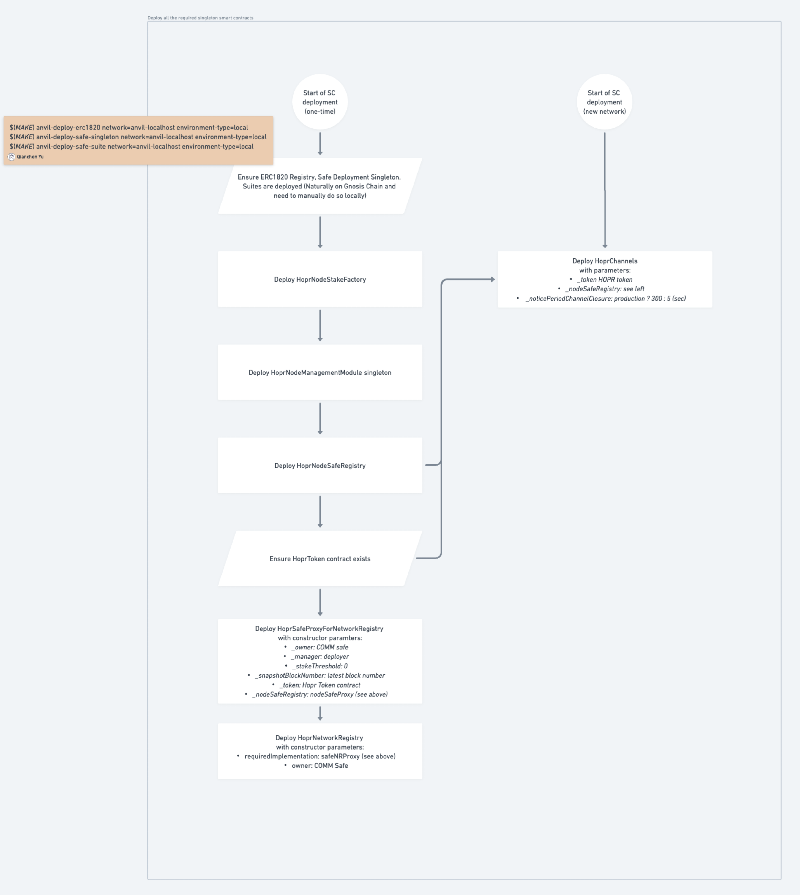

## Introduction

This documents provides an overview of the HOPR smart contracts as the basis for
the smart contracts audit in 08/2023. It describes the relevant threat model,
sets the scope, gives a high-level description of the relevant smart contracts
and their relation and ABIs. Moreover, it provides pointers to the source code
and steps on how to run tests and other operations on it.

## Scope

---

**FIXME:**

Pin final version prior to submitting for audit.

---

All HOPR smart contracts can be found in the hoprnet monorepo:

```
https://github.com/hoprnet/hoprnet
```

The Git commit hash under audit is:

```
d3dbcbe20975c1b0b4bd02fa8afaf42cf0d34c25
```

All smart contracts can be found within the folder:

```
packages/ethereum/contracts/src
```

For convenience, the following link points to the source folder using the
correct version:

```
https://github.com/hoprnet/hoprnet/tree/d3dbcbe20975c1b0b4bd02fa8afaf42cf0d34c25/packages/ethereum/contracts/src
```

Specifically, the following contracts are within the scope of the audit:

```bash
├── Channels.sol
├── Crypto.sol
├── MultiSig.sol
├── interfaces
│   ├── IAvatar.sol
│   ├── INetworkRegistryRequirement.sol
│   ├── INodeManagementModule.sol
│   └── INodeSafeRegistry.sol
├── node-stake
│   ├── NodeSafeRegistry.sol
│   ├── NodeStakeFactory.sol
│   └── permissioned-module
│       ├── CapabilityPermissions.sol
│       ├── NodeManagementModule.sol
│       └── SimplifiedModule.sol
└── utils
    ├── EnumerableStringSet.sol
    ├── EnumerableTargetSet.sol
    └── TargetUtils.sol
```

### Out of Scope

The following contracts are out of scope:

```bash
├── Announcements.sol # node announcement scheme which is independent from staking
├── Ledger.sol # snapshot-based indexing of Hopr Channels
├── NetworkRegistry.sol # implements network gate which will be removed eventually
├── TicketPriceOracle.sol # standalone oracle to change HOPR ticket price network-wide
├── proxy # implementations of adapters between network registry and staking
│   ├── DummyProxyForNetworkRegistry.sol
│   ├── SafeProxyForNetworkRegistry.sol
│   └── StakingProxyForNetworkRegistry.sol
└── static # existing contracts which will not be updated
    ├── EnumerableStringSet.sol
    ├── ERC777
    │   └── ERC777Snapshot.sol
    ├── HoprDistributor.sol
    ├── HoprForwarder.sol
    ├── HoprToken.sol
    ├── HoprWrapper.sol
    ├── HoprWrapperProxy.sol
    ├── openzeppelin-contracts
    │   ├── ERC777.sol
    │   └── README.md
    └── stake
        ├── HoprBoost.sol
        ├── HoprStake.sol
        ├── HoprStake2.sol
        ├── HoprStakeBase.sol
        ├── HoprStakeSeason3.sol
        ├── HoprStakeSeason4.sol
        ├── HoprStakeSeason5.sol
        ├── HoprStakeSeason6.sol
        ├── HoprStakeSeason7.sol
        ├── HoprWhitehat.sol
        └── IHoprBoost.sol
```

## Concepts

The HOPR protocol uses smart contracts for different concepts. The 2 relevant
concepts for this audit are the `Incentivization Mechanism` and `Staking`. Other
concepts, while using smart contracts, don't touch funds or have limited impact
on the operation of the protocol which is why they are not in the scope of the
audit.

### Staking

Presentation (WIP) which explains the new staking design:

```
https://docs.google.com/presentation/d/1oNG4LIBT0PKDHP1naOykdOaMaxlOxug7v3pQehwjBWc/edit?usp=sharing
```

todo




### Incentivization Mechanism

The HOPR protocol relies on node's being paid for relaying packets. This
payment, the incentiviation, ensures nodes perform their service as best as
they can. Its realized through the novel `Proof of Relay` scheme, whereby its
cryptograhically ensured that a node has performed the relay service and may try
to get paid for it. The payment is encapsulated as a so called `Ticket` which
has a `Winning Probability`. The implementation of this uses unidirectional
payment channels between two nodes where the source node locks funds into the
channel, assuring the destination node that it can get paid out of those locked
funds when performing the relaying service. In order to get paid the destination
node presents a received ticket via the `redeemTicket` function, which may lead
to a payout of funds.

The on-chain parts of this concept are implemented in the `Channels.sol` file as
the `HoprChannels` contract.

## Threat Model

In our design we consider the following actors:

1. Node Runner: A user who is running one or many HOPR nodes and therefore
   participates in the network.
2. Node Runner: A user who is running one or many HOPR nodes and therefore
   participates in the network. With ill intend the user may try to cheat the
   network to (a) earn more rewards, (b) deny other users their rewards or
   (c) circumvent privacy assurances given by the protocol.
3. Attacker: A user who is not running any nodes but exploits weaknesses in a
   node runner's setup both on- and off-chain.

As explained previously we also distinguish between 3 private keys:

1. Packet Key: An ed25519 key which is used by a single node. Its generated by
   the node itself at initialization of the node. The packet key is used for
   HOPR packet-related cryptographic operations. Via separation of concerns its
   different from the chain key on purpose.
2. Chain Key: An secp256k1 key which is used by a single node. Its generated by
   the node itself at initialization of the node. The chain key is used for any
   on-chain operation of the node. In wallet-terms it may be considered to be a
   hot wallet, because the node can use it at runtime without user interaction.
3. Admin Key: An on-chain EOA or smart contract wallet which is used by a user
   to set up and manage their staking account.

The following assumptions are made:

- An admin key is safe against exploitation. Thus, our measures don't concern
  themselves with compromised admin keys and rely on general account safety
  measures performed by the user.
- The system a node is running on may be exploited, giving the attacker access
  to the packet key and/or chain key of that node.

Based on that these scenarios were considered in the design of the staking and
incentiviation mechanism:

1. A node's chain key is compromised. The attacker gains the ability to perform
   on-chain operations using that key.
   1.1. The attacker may drain the xDai balance of the account. We advise users to
   store a minimal amount of funds needed to pay for on-chain operations but don't
   overfund the account or use it to store xDai for a longer period of time.
   1.2. The attacker may close payment channels. Funds (wxHOPR) from those payment
   channels would flow back into the staking account.
   1.3. The attacker may delete the chain key. The node would become inoperable.
   The user could recover funds by initiating payment channel closures with the
   admin key.
2. A node's packet key is compromised. The attacker gains no funds-related
   capabilities.

## Contracts

The following is a short overview of each contract's purpose. Refer to the
contract's source code for more documentation.

### CapabilityPermissions.sol

### Channels.sol

Implementation of HOPR payment channels.

### Crypto.sol

Bundles cryptographic primitives used by other contracts.

### EnumerableStringSet.sol

Adaptation of OpenZeppelin's EnumerableSet library for `string` type.

### EnumerableTargetSet.sol

Adaptation of OpenZeppelin's EnumerableSet and EnumerableMap (`AddressToUintMap`)
libraries for `TargetDefaultPermissions` type.

### IAvatar.sol

Interface for Avatar (Safe). Slightly enhanced version based on the original
from Safe.

### INodeManagementModule.sol

Interface for custom functions exposed by the `HoprNodeManagementModule`
contract.

### INodeSafeRegistry.sol

Minimum interface for `NodeSafeRegistry` contract.

### NodeManagementModule.sol

Permissioned capability-based Safe module for checking HOPR nodes operations.

### NodeSafeRegistry.sol

Registry to set up a trusted link from a HOPR node to a HOPR safe, such
that a HOPR node is only used by a single HOPR safe at a time.

### NodeStakeFactory.sol

The deployment and initialization of a HOPR staking safe is performed through
this factory contract.

### SimplifiedModule.sol

Adaptation of Zodiac's `Module.sol`.

### TargetUtils.sol

Helper functions for operations on `Target`s.

## Testing

All smart contracts in scope have test coverage using unit tests and fuzzy
tests. These tests use `forge` and may be executed by running the following
commands:

```bash
make deps
cd packages/ethereum/contracts
make sc-test
```

Coverage reports can be generated as well:

```bash
cd packages/ethereum/contracts
make sc-audit-coverage
firefox report/index.html
```
