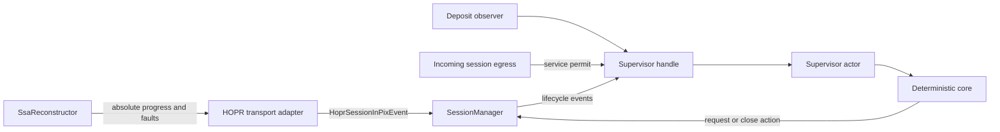
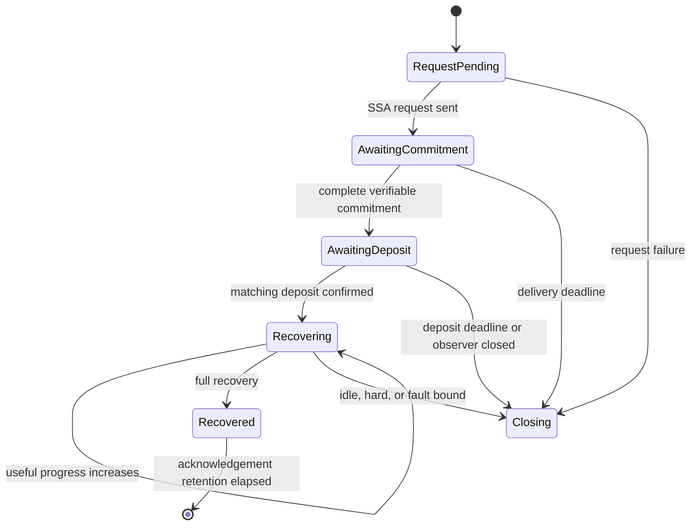

# Requirements

### Outcome
Create `session-pix-supervisor.md` at the repository root as the durable implementation guide, then add a standalone, separately unit-testable `SessionPixSupervisor` for PIX-enabled incoming sessions.

The supervisor is the sole PIX policy authority: it owns per-SSA lifecycle state, deadlines, progress, fault counts, overlap, and PIX-driven close/request decisions. `SessionManager` remains responsible for network I/O, reconstructor calls, session-cache removal, and executing supervisor actions.

### Scope
#### In scope
- One supervisor actor per incoming `Capability::UsePIX` session; outgoing Entry sessions and non-PIX sessions do not create one.
- A deterministic core driven by explicit timestamps, wrapped by a per-session actor that serializes lifecycle, deposit, recovery, fault, service, and deadline events.
- Separate commitment-delivery, deposit, recovery-idle, and absolute-recovery bounds.
- Progress defined only as a newly accepted, unique, cryptographically verified share for the exact SSA.
- Per-SSA and session-lifetime unverifiable-share accounting using absolute monotonic observations.
- Safe overlap of the recovering SSA and the next SSA requested at early recovery.
- A provisional predeposit service allowance: count Exit return-service packets from the first packet, pause once the SSA could otherwise become fully recoverable before funding, and release queued service after matching deposit confirmation.
- Detailed internal PIX closure reasons and one generic public `ClosureReason::PixFailure` mapping.
- Focused changes in `hopr-protocol-pix` and `hopr-transport` needed to supply trustworthy progress/fault observations.

#### Deferred explicitly
- A hard postdeposit packet ceiling. The current wire contract prices `polynomials × threshold`, while the generator emits unnegotiated surplus shares; safe enforcement requires surplus negotiation and pricing first.
- Changes to the Start-protocol wire format or `hopr-protocol-start`.
- The full two-phase `CommitmentsAccepted` funding handshake. Waiting for `SsaCommitmentState::is_verifiable` improves Exit-side safety, but Entry-side proof of remote acceptance remains a follow-up.
- Changing the strategy/chain-facing deposit event contract.
- Treating empty shares as attributable faults. They remain non-progress and therefore cannot refresh recovery deadlines.

### Acceptance Criteria
- `SessionHandles::PixKillSwitch`, `SessionHandles::DepositAwaiter`, and manager-owned incoming PIX error/index policy are removed.
- Every open incoming PIX session always has at least one supervised SSA phase or a pending close action.
- Deposit success transitions to recovery supervision; it never disables PIX enforcement.
- Only a strictly increasing useful-share snapshot resets the matching SSA’s idle deadline.
- Invalid, duplicate, empty, stale, unknown, or surplus-after-threshold observations do not refresh recovery time.
- The hard recovery deadline never moves, even under slow useful progress.
- Early/full recovery, deposit, and fault events affect only their exact `SsaId`; old and next SSA guards may overlap.
- Duplicate/reordered internal events are idempotent, and close/request actions are emitted at most once.
- The implementation guide records goals, contracts, transitions, wiring, invariants, tests, cross-crate work, deferred work, and operational defaults.

# Technical Design

### Current Implementation
- `transport/session/src/manager.rs` stores Exit SSA index and session-wide errors in `SessionSsaState`, starts a combined `PixKillSwitch` in `request_next_ssa`, and aborts it from a separate deposit awaiter.
- `SessionManager::dispatch_pix_event` directly requests the next SSA or closes after four `UnverifiableShare` events, without applying the event’s SSA index to policy state.
- `handle_ssa_commit` emits `DepositNeeded` when the address is first known, even though `hopr-protocol-pix::SsaCommitmentState::is_verifiable` distinguishes complete commitment installation.
- `protocols/pix/src/reconstructor/mod.rs` collapses useful partial shares into `ProcessedAckResult::NoProgress`; `acknowledge_shares` also deduplicates invalid resolutions through a `HashSet`.
- `transport/hopr/src/lib.rs` translates `ShareResolution` into `HoprSessionInPixEvent` in both Exit and relay-as-Exit branches.

### Chosen Architecture
Use the selected **actor plus deterministic core** model.



- `SessionPixSupervisor` is the pure state machine. Methods take `std::time::Instant`; no method sleeps, spawns, accesses the session cache, or performs network I/O.
- `SessionPixSupervisorHandle` is cloneable and sends typed commands to one per-session worker.
- The worker recomputes `next_deadline()` after every command and selects between the command stream and one sleep. On wake it calls `expire(now)`, so a stale timer can never close state that has already transitioned.
- A per-session action driver executes `RequestSsa` and `Close` through `SessionManager`; action execution results are fed back to the actor.

### Files and Types
Add:
- `transport/session/src/pix/mod.rs`
- `transport/session/src/pix/supervisor.rs`
- `session-pix-supervisor.md`

Core crate-private contracts should be equivalent to:

```rust
struct SessionPixSupervisor { /* deterministic state */ }
struct SessionPixSupervisorHandle { /* command sender */ }

enum SessionPixEvent {
    SsaRequestSent(SsaId<HoprPseudonym>),
    CommitmentVerified(SsaId<HoprPseudonym>),
    DepositConfirmed(SsaId<HoprPseudonym>),
    DepositObserverClosed(SsaId<HoprPseudonym>),
    RecoveryProgress(SsaRecoveryProgress<HoprPseudonym>),
    AlmostRecovered(SsaId<HoprPseudonym>),
    Recovered(SsaId<HoprPseudonym>),
    UnverifiableShares { ssa_id: SsaId<HoprPseudonym>, observed: u64 },
}

enum SessionPixAction {
    RequestSsa { ssa_id: SsaId<HoprPseudonym>, polys: u16, threshold: u16 },
    Close(SessionPixCloseReason),
}
```

`SessionPixCloseReason` should retain the exact SSA and cause (`CommitmentTimeout`, `DepositTimeout`, `DepositObserverClosed`, `RecoveryIdle`, `RecoveryDeadline`, `TooManyUnverifiableShares`, `InvalidTransition`, `SupervisorUnavailable`). `SessionManager` logs it structurally and maps it to `ClosureReason::UnrealizedDeposit` for predeposit failures or new `ClosureReason::PixFailure` for recovery/policy failures.

### Configuration
Keep existing `IncomingSessionPixConfig.max_ssa_delivery_time` and `max_deposit_wait`. Add:
- `max_recovery_idle` (default 60 seconds).
- `max_recovery_time` (default 10 minutes).
- `max_unverifiable_shares_per_ssa` and `max_unverifiable_shares_per_session` (default three tolerated observations; the fourth closes).

At `SessionManager::start`, validate nonzero/ordered durations against `SsaReconstructorConfig`: idle must not be shorter than `max_ack_await_time`, and absolute recovery must not outlive `incomplete_ssa_lifetime`. Retain recovered SSA tombstones for at least the acknowledgement window so late events remain attributable without mutating a newer SSA.

### Manager Integration
Refactor `SessionSlot` to separate immutable Entry negotiation data from incoming supervision, for example `ssa_params: Option<SessionSsaParameters>` plus `pix_supervisor: Option<SessionPixSupervisorHandle>`.

For an incoming PIX session:
1. Validate exact PIX dimensions and create the supervisor before exposing the `HoprSession`.
2. Insert its worker/action-driver handles into `SessionSlot.abort_handles`.
3. Ask the actor for the initial `RequestSsa`, execute it synchronously before committing `SessionSlotGuard`, then acknowledge `SsaRequestSent` so the commitment deadline begins only after successful send.
4. Replace `request_next_ssa` with `send_ssa_request(ssa_id, params)`; the supervisor owns monotonic SSA indices and request idempotence.
5. In `handle_ssa_commit`, feed fragments to the reconstructor but notify the supervisor and emit `DepositNeeded` only when `is_verifiable` is true. Start an SSA-indexed deposit observer (`SessionHandles::PixDepositObserver(SsaIndex)`) that only translates `Some`, channel closure, or cancellation into actor events; it owns no policy timer.
6. Make `dispatch_pix_event` a routing adapter to the session’s supervisor. Missing/closed supervisor channels fail closed through `PixFailure`.
7. Execute `Close` by atomically removing from `SessionManager.sessions`, decrementing `active_sessions` once, and calling existing `close_session`; normal session teardown aborts the actor, action driver, and all indexed deposit observers.

### Provisional Service Behavior
- Route incoming-session application egress—and manager keep-alives that consume recovery-bearing SURBs—through `SessionPixSupervisorHandle::acquire_service_permit` before forwarding to the underlying sink. Start/PIX handshake control messages remain exempt.
- Before any SSA is funded, permit at most `target_useful_shares - 1` return-service opportunities, preventing full recovery before payment; queue/backpressure further writes rather than failing the socket.
- On matching deposit confirmation, release queued permits. Continue recording fail-safe service reservations against the oldest serving SSA, including predeposit reservations, but do not impose a postdeposit packet ceiling in this task.
- During overlap, a still-funded/recovering old SSA remains the serving SSA. The next SSA’s unfunded allowance becomes relevant only after the old SSA recovers.

### Architecture Invariants
- No lock is held across an `.await`; all policy mutation occurs in actor order.
- Every event is matched by full `SsaId`; a newer SSA can never clear an older guard.
- `AlmostRecovered` requests the next SSA once but does not retire the old SSA. `Recovered` retires only the matching SSA and requests a next SSA as a fallback if early recovery was never observed.
- Action-send failure, actor termination, or request execution failure closes the session rather than leaving it unsupervised.

# Behavior

### Per-SSA State Machine


### Progress Definition
`hopr-protocol-pix` must expose an absolute snapshot:

```rust
struct SsaRecoveryProgress<P> {
    ssa_id: SsaId<P>,
    useful_shares: u64,
    target_useful_shares: u64,
    recovered_polynomials: u16,
}
```

A share increments `useful_shares` only after decryption and commitment verification, when its canonical evaluation identifier has not already been accepted for that polynomial, and while that polynomial is below threshold. The target is `polynomials × threshold`. Duplicates, invalid/empty shares, unknown acknowledgements, stale SSA data, and shares after a polynomial reaches threshold do not count.

The supervisor stores the largest snapshot per SSA. Only `new.useful_shares > stored.useful_shares` is progress; equal/lower reordered snapshots are no-ops. A target inconsistent with negotiated dimensions is an internal protocol violation. Progress before deposit is recorded but never extends commitment/deposit deadlines; deposit confirmation starts a fresh recovery-idle window from confirmation time.

### Deadline and Event Rules
| Event | Required phase | Effect | Refreshes recovery idle? |
|---|---|---|---|
| SSA request sent | `RequestPending` | Start commitment-delivery deadline | No |
| Verifiable commitment | `AwaitingCommitment` | Start independent deposit deadline; expose `DepositNeeded` | No |
| Matching deposit | `AwaitingDeposit` | Enter `Recovering`; start idle and immutable hard deadlines | Starts it |
| Deposit sender closes | `AwaitingDeposit` | Close immediately because confirmation is no longer deliverable | No |
| Larger useful snapshot | Any known SSA | Record absolute progress; update matching recovery state | Only in `Recovering` |
| Equal/lower snapshot | Any known SSA | Ignore as duplicate/reordering | No |
| Invalid-share absolute count | Known/recent SSA | Apply positive delta to SSA and session totals | No |
| Almost recovered | Known active SSA | Emit one next-SSA request; retain old guard | No |
| Fully recovered | Known active SSA | Clear only that SSA’s deadlines; keep tombstone | Terminal |
| Empty/unknown/stale observation | Any | Trace/ignore or count as non-attributable protocol diagnostics | No |
| Earliest live deadline | Matching phase | Recheck current state, then emit one close action | N/A |

The idle timeout prevents silence; the hard timeout prevents an attacker from sending one useful share just before each idle expiry. Progress on a newer SSA never protects a stalled older funded SSA. Any live SSA deadline expiring closes the whole session.

### Unverifiable Shares
`hopr-protocol-pix` should emit an absolute per-SSA invalid count, not one deduplicatable marker. The supervisor applies only the increase over the stored count, preserving correctness under duplicate/reordered events. It closes when either the per-SSA or session-lifetime tolerated count is exceeded. Completed/recent SSA faults still contribute to the session total but cannot alter a newer SSA’s phase.

### Documentation Deliverable
`session-pix-supervisor.md` must be independently actionable and contain:
- Motivation and threat model.
- Goals, selected decisions, and explicit non-goals.
- Current-code references and replacement map.
- Architecture and state diagrams.
- Exact event/action/config/progress contracts.
- Full transition/deadline table and overlap examples.
- Incoming-session construction, request, commitment, deposit, progress, service, and teardown sequences.
- Race/idempotence/fail-closed invariants.
- Required and deferred cross-crate changes.
- File-by-file implementation checklist.
- Unit, manager-integration, protocol, transport, and end-to-end test matrix.
- Follow-ups for surplus negotiation, hard quota enforcement, and remote commitment acknowledgement.

# Testing & Crates

### Required Cross-Crate Changes
#### `hopr-protocol-pix` — required
Modify `protocols/pix/src/reconstructor/utils.rs`, `reconstructor/mod.rs`, `traits.rs`, and exports in `lib.rs`:
- Detect canonical duplicate evaluation identifiers in `SsaPartBuilder`.
- Track absolute useful-share/recovered-polynomial progress and per-SSA invalid counts.
- Add `SsaRecoveryProgress` and progress/absolute-fault `ShareResolution` data.
- Replace `HashSet` result collection with deterministic aggregation so multiple invalid shares in one acknowledgement batch are not collapsed and terminal events follow their final progress snapshot.

#### `hopr-transport` — required
Update the two adapters in `transport/hopr/src/lib.rs` (prefer one private shared helper) to translate progress and absolute fault resolutions into the expanded `HoprSessionInPixEvent`, while preserving recovered-key forwarding to `PixEvent::PrivateKeyRecovered`.

#### Other crates
- `hopr-protocol-start`: no production change in this scope.
- `impls/strategy` and `hopr-api`: keep the existing deposit notifier payload; no production change required.
- `transport/hopr/src/protocol/pipeline/mod.rs`: no empty-share event is required for timeout-first enforcement; empty shares remain non-progress.
- `hopr-lib`: production wiring already passes `IncomingSessionPixConfig`; only the existing multi-cycle test may need assertions/config values.

### Supervisor Unit Tests
Colocate exhaustive pure-core tests in `transport/session/src/pix/supervisor.rs` using explicit `Instant` values:
- Every valid phase transition and every phase deadline.
- Stale timer wake after a transition does not close.
- Useful progress extends only idle time; hard time never moves.
- Duplicate/lower/wrong-SSA progress does not extend time.
- Deposit confirmation, duplicate confirmation, channel closure, timeout, and wrong SSA.
- Fourth invalid observation closes at defaults; duplicate absolute counts do not double-charge; session totals survive rotation.
- Early recovery requests once; full recovery fallback requests once.
- Old/next overlap, independent deadlines, and exact-SSA cleanup.
- Completed tombstones accept late events only during retention.
- Provisional permits stop before full unfunded recovery, resume on deposit, and remain attributed to the oldest serving SSA.
- Close and request actions are emitted at most once; index overflow and actor/action-channel failure fail closed.

### Protocol and Integration Tests
- Extend reconstructor tests to prove one progress increment per unique verified share, no duplicate increment, correct targets/polynomial counts, deterministic progress-before-milestone ordering, and multiple invalid observations in one batch.
- Replace manager policy tests around `dispatch_pix_event` with wiring tests: supervisor creation only for incoming PIX, initial request acknowledgement, `is_verifiable` deposit gating, observer closure, action execution, and cleanup.
- Add manager tests proving no-progress idle closure, genuine progress extension, immutable hard closure under trickle progress, overlap isolation, and provisional service backpressure/release in both rate-controlled and `NoRateControl` branches.
- Update `transport/session/tests/pix.rs` for the new deposit/supervisor lifecycle.
- Keep `hopr/hopr-lib/tests/transport_session_pix.rs::capture_one_hop_pix_session` as the three-cycle end-to-end regression for real progress forwarding and uninterrupted rotation.

### Validation Commands
Run formatting/lints plus targeted suites:

```text
cargo fmt --check
cargo test -p hopr-protocol-pix
cargo test -p hopr-transport-session
cargo test -p hopr-transport
cargo test -p hopr-lib --test transport_session_pix --features testing
```

### Known Residual Risk
Until surplus is negotiated and priced, the supervisor’s hard recovery deadline bounds time but not postdeposit service volume. The implementation guide must state this prominently and must not describe service accounting as a security-enforced quota.

# Delivery Steps

### Step 1: Implement the deterministic supervisor core and implementation guide
A standalone PIX state machine and durable implementation specification define all lifecycle, deadline, overlap, fault, and provisional-service behavior.

- Add `transport/session/src/pix/mod.rs` and `transport/session/src/pix/supervisor.rs` with core state, config, events, actions, close reasons, deadline calculation, and actor/handle scaffolding.
- Add the new recovery/fault policy fields to `IncomingSessionPixConfig` with validated defaults compatible with reconstructor retention.
- Write `session-pix-supervisor.md` with the architecture, contracts, transition table, manager wiring, invariants, cross-crate checklist, tests, and deferred surplus/quota work.
- Add exhaustive timestamp-driven core tests and actor failure/ordering smoke tests as part of this stage.

### Step 2: Expose trustworthy reconstruction progress and fault counters
The PIX reconstructor emits idempotent absolute observations for every SSA that the supervisor can safely consume.

- Update `SsaPartBuilder` to distinguish unique verified shares from duplicates and already-complete polynomials.
- Add `SsaRecoveryProgress` and absolute per-SSA invalid counts to `ShareResolution`; remove result deduplication that collapses faults.
- Guarantee deterministic ordering of final progress, early recovery, and full recovery outputs.
- Extend `hopr-protocol-pix` unit/integration tests for uniqueness, monotonicity, batching, invalid counts, and terminal milestones.

### Step 3: Wire supervisor ownership into incoming SessionManager lifecycles
Every incoming PIX session is continuously supervised from initial SSA request through deposit, overlapping recovery, and teardown.

- Split Entry-side negotiated SSA parameters from Exit-side supervisor state in `SessionSlot`.
- Replace `PixKillSwitch`, `DepositAwaiter`, manager error counters, and manager-owned SSA indices with the actor, action driver, and SSA-indexed deposit observers.
- Refactor request sending to execute supervisor-issued IDs, gate `DepositNeeded` on `is_verifiable`, route all PIX events through the handle, and map close actions through atomic session removal.
- Add manager tests for setup rollback, deposits, channel closure, idle/hard deadlines, faults, overlap, action idempotence, and task cleanup.

### Step 4: Integrate transport observations and provisional service control
Real packet/reconstruction traffic reaches the supervisor, and unfunded return service is bounded and released only by matching confirmation.

- Extend the Exit and relay-as-Exit resolution adapter in `transport/hopr/src/lib.rs` to forward progress and absolute invalid counts, preferably through one shared helper.
- Wrap incoming-session application/eligible keep-alive egress with supervisor permits in both rate-controlled and `NoRateControl` paths; retain fail-safe accounting after funding without enforcing a postdeposit quota.
- Update `transport/session/tests/pix.rs` and the existing `hopr-lib` multi-cycle PIX regression to cover confirmation, progress, rotation, and uninterrupted funded traffic.
- Run the targeted protocol, session, transport, and `hopr-lib` test suites and keep the standalone guide synchronized with the implemented contracts.