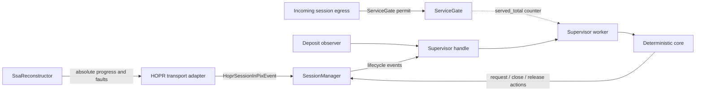
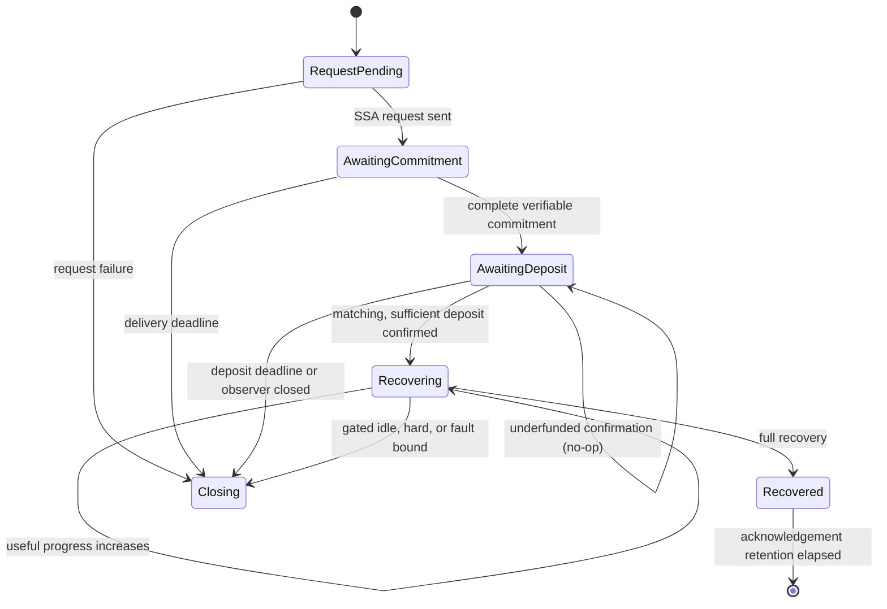

# SessionPixSupervisor — Requirements & Design

This document is the durable implementation guide for the PIX session supervisor.
The step-by-step executable plan (files, ordered changes, test cases, validation
commands) lives in [`session-pix-supervisor-plan.md`](session-pix-supervisor-plan.md).

# Requirements

### Outcome

Add a standalone, separately unit-testable `SessionPixSupervisor` for PIX-enabled
incoming sessions, implemented as a new module (`src/pix/`) inside the
`hopr-transport-session` crate.

The supervisor is the sole PIX policy authority: it owns per-SSA lifecycle state,
deadlines, progress, fault counts, overlap, service gating, and PIX-driven
close/request decisions. `SessionManager` remains responsible for network I/O,
reconstructor calls, session-cache removal, and executing supervisor actions.

### Design principle

Enforcement is **service-relative, not wall-clock**. The threat is "return service
consumed without payment progress", so idle detection is gated on service actually
having been consumed, the predeposit allowance is a bounded packet budget, and the
absolute recovery deadline is a resource backstop rather than the anti-drip
mechanism. Wall-clock proxies both over-trigger on honest quiet/slow sessions and
under-constrain attackers.

### Scope

#### In scope

- One supervisor actor per incoming `Capability::UsePIX` session; outgoing Entry
  sessions and non-PIX sessions do not create one.
- A deterministic core driven by explicit timestamps and explicit service
  counters, wrapped by a per-session actor that serializes lifecycle, deposit,
  recovery, fault, service, and deadline events.
- Separate commitment-delivery, deposit, recovery-idle, and absolute-recovery
  bounds. Recovery-idle expiry is **gated on service consumption** (see Behavior).
- Progress defined only as a newly accepted, unique, cryptographically verified
  share for the exact SSA.
- Per-SSA and session-lifetime unverifiable-share accounting using absolute
  monotonic observations, with explicit counter lifecycle in the reconstructor
  (counters are never TTI-evicted while supervised; a decrease is a protocol
  violation, never silently ignored).
- Deposit **amount** validation as defense in depth: the confirmation already
  carries a `HoprBalance`; an underfunded confirmation is a no-op (the deposit
  deadline keeps running), never a transition to `Recovering`.
- Safe overlap of the recovering SSA and the next SSA requested at early recovery.
  Early recovery on a still-unfunded SSA **defers** the next-SSA request until that
  SSA's deposit confirms (it is never dropped).
- A bounded provisional predeposit service budget:
  `min(target_useful_shares − 1, max_predeposit_packets)` return-service packets,
  **session-global** until the first deposit confirms; queue/backpressure further
  writes, release the queue on matching confirmation.
- Detailed internal PIX closure reasons, one generic public
  `ClosureReason::PixFailure` mapping, per-close-reason metrics, and error-level
  diagnostics for the "no deposit consumer" misconfiguration.
- Focused changes in `hopr-protocol-pix` and `hopr-transport` needed to supply
  trustworthy progress/fault observations and explicit counter lifecycle.

#### Known bugs fixed by this work (each requires a regression test)

1. **Silent session stall**: if a single acknowledgement batch completes recovery,
   `check_early_threshold` never fires, `AlmostRecoveredSsa` is never emitted, and
   today's `SsaRecovered → no-op` (`manager.rs:1541`) means the next SSA is never
   requested. The supervisor's full-recovery fallback request fixes this.
2. **Wrong closure reason**: the too-many-unverifiable-shares path closes via
   `SessionManager::close_session` and reports `ClosureReason::Eviction`, not a
   PIX-specific reason.
3. **Fault amnesia on rotation**: `SessionSsaState::increment_index` resets the
   session-wide error counter to zero, so rotating SSAs launders accumulated
   faults. Session-lifetime totals must survive rotation.
4. **Deposit-channel closure only logs**: today `DepositAwaiter` logs and leaves
   closure to the kill switch; confirmation is provably undeliverable at that
   point, so the session should fail fast with a distinct reason.

#### Deferred explicitly

- A hard postdeposit packet ceiling. The wire contract prices
  `polynomials × threshold`, while the generator emits unnegotiated surplus
  shares; safe enforcement requires surplus negotiation and pricing first.
- A count-based `max_served_without_progress` bound (close when N packets were
  served since the last useful share). The service-gated idle expiry covers the
  correctness problem; the count bound needs a bound derivation that accounts for
  legitimate surplus-share runs (`threshold + surplus_shares` plus slack) and is
  follow-up work.
- Changes to the Start-protocol wire format or `hopr-protocol-start`.
- The full two-phase `CommitmentsAccepted` funding handshake. Waiting for
  `SsaCommitmentState::is_verifiable` improves Exit-side safety, but Entry-side
  proof of remote acceptance remains a follow-up.
- Changing the strategy/chain-facing deposit event contract. (Deposit amount
  validation uses the `HoprBalance` already present in the notifier payload.)
- Treating empty shares as attributable faults. They remain non-progress and
  therefore cannot refresh recovery deadlines.
- Price-per-byte plumbing into `SessionManager` if it is not already reachable:
  `expected_deposit` is `Option<HoprBalance>`; `None` preserves today's
  accept-any behavior while the contract already supports validation.

### Acceptance Criteria

- `SessionHandles::PixKillSwitch`, `SessionHandles::DepositAwaiter`, and
  manager-owned incoming PIX error/index policy are removed.
- Every open incoming PIX session always has at least one supervised SSA phase or
  a pending close action.
- Deposit success transitions to recovery supervision; it never disables PIX
  enforcement. An underfunded deposit confirmation does not transition.
- Only a strictly increasing useful-share snapshot resets the matching SSA's idle
  deadline.
- Invalid, duplicate, empty, stale, unknown, or surplus-after-threshold
  observations do not refresh recovery time.
- The idle deadline never closes a session on which no return-service packet was
  sent since the last useful progress (or since entering `Recovering`).
- The hard recovery deadline never moves, even under slow useful progress.
- A decreasing absolute counter observation is handled as a protocol violation
  (close as `InvalidTransition`), never silently ignored.
- Early/full recovery, deposit, and fault events affect only their exact `SsaId`;
  old and next SSA guards may overlap.
- Duplicate/reordered internal events are idempotent, and close/request actions
  are emitted at most once.
- A buffered deposit confirmation followed by sender drop funds the session; it
  is never reported as observer closure (drain-before-close).
- Per-close-reason metrics exist; `DepositObserverClosed` produces an error-level
  log naming the likely misconfiguration.

# Technical Design

### Current Implementation (verified against the code)

- `transport/session/src/manager.rs` stores the Exit SSA index and a session-wide
  error counter in `SessionSsaState` (`manager.rs:160`); `increment_index` resets
  the error counter (bug 3 above). The unverifiable-share threshold is the
  hardcoded `MAX_ALLOWED_UNVERIFIABLE_PIX_SHARES = 3` (`manager.rs:129`).
- `request_next_ssa` (`manager.rs:1364`) installs one combined `PixKillSwitch`
  timer (`max_deposit_wait + max_ssa_delivery_time`) closing with
  `ClosureReason::UnrealizedDeposit`; `handle_ssa_commit` installs a separate
  `DepositAwaiter` that aborts the kill switch on confirmation and only logs on
  channel closure/timeout (`manager.rs:2245`).
- `SessionManager::dispatch_pix_event` (`manager.rs:1524`) requests the next SSA
  on `SsaAlmostRecovered`, no-ops on `SsaRecovered` (bug 1), and closes after the
  fourth `UnverifiableShare` via `close_session`, which reports
  `ClosureReason::Eviction` (bug 2). The event's SSA index is never applied to
  policy state.
- `handle_ssa_commit` emits `DepositNeeded` when
  `deposit_address_first_encountered` is true, even though
  `SsaCommitmentState::is_verifiable` (set at `reconstructor/mod.rs:284`)
  distinguishes complete commitment installation.
- `protocols/pix/src/reconstructor/mod.rs` collapses useful partial shares into
  the private `ProcessedAckResult::NoProgress`; `acknowledge_shares` deduplicates
  resolutions through an `ahash::HashSet` (`mod.rs:331`), enabled by manual
  `Hash`/`Eq` impls on `ShareResolution` keyed by `SsaId` (`traits.rs:27-51`).
  All reconstructor state lives in moka caches with TTI/TTL eviction
  (`SsaReconstructorConfig`, `mod.rs:19-62`); `incomplete_ssa_lifetime` (600 s)
  is a time-to-_idle_.
- `transport/hopr/src/lib.rs` translates `ShareResolution` into
  `HoprSessionInPixEvent` in two byte-identical branches (Exit `:787-828`,
  relay-as-Exit `:888-928`).
- The Exit's `NonAnonymousPixStrategy` already polls until
  `balance >= target_deposit` before sending the confirmation
  (`impls/strategy/src/non_anonymous_pix.rs:142`), so supervisor-side amount
  validation is defense in depth against other/buggy notifier producers.
- Egress backpressure today is only the SURB-balancer `RateController`, absent in
  the `NoRateControl` branch (`manager.rs:1957-1965`); there is no PIX-tied
  permit mechanism, and `NoRateControl` sessions have no keep-alives.

### Chosen Architecture

Use the selected **actor plus deterministic core** model, extended with a shared
lock-free **service gate** on the egress hot path.



- `SessionPixSupervisor` is the pure state machine. Methods take
  `std::time::Instant` **and an explicit `served_total: u64` sample**; no method
  sleeps, spawns, accesses the session cache, reads atomics, or performs network
  I/O. Determinism and testability follow from all inputs being explicit.
- `SessionPixSupervisorHandle` is cloneable and sends typed commands to one
  per-session worker.
- `ServiceGate` is a small shared struct (atomic served counter + bounded
  predeposit budget + funded flag). `acquire_service_permit` is **not** a
  round-trip through the actor: after funding it is a single atomic increment;
  before funding it draws from the bounded budget and parks the writer when the
  budget is exhausted. The worker samples `served_total` from the gate whenever
  it calls into the core.
- The worker recomputes `next_deadline()` after every command and selects between
  the command stream and one sleep. On wake it calls
  `handle_deadline(now, served_total)`, so a stale timer can never close state
  that has already transitioned, and an idle expiry with no service consumed
  re-arms instead of closing.
- A per-session action driver executes `RequestSsa` and `Close` through
  `SessionManager`; action execution results are fed back to the actor.
  `ReleaseService` is executed by the worker directly against the gate.

### Files and Types

Add, inside the `hopr-transport-session` crate:

- `transport/session/src/pix/mod.rs` — module root, config, public-in-crate re-exports.
- `transport/session/src/pix/supervisor.rs` — deterministic core + exhaustive tests.
- `transport/session/src/pix/worker.rs` — actor, handle, action driver.
- `transport/session/src/pix/gate.rs` — `ServiceGate` + tests.

Core crate-private contracts should be equivalent to:

```rust
struct SessionPixSupervisor { /* deterministic state */ }

impl SessionPixSupervisor {
    fn new(cfg: SupervisorConfig, dims: SsaDimensions, now: Instant)
        -> (Self, Vec<SessionPixAction>);
    fn handle_event(&mut self, ev: SessionPixEvent, now: Instant, served_total: u64)
        -> Vec<SessionPixAction>;
    fn handle_deadline(&mut self, now: Instant, served_total: u64)
        -> Vec<SessionPixAction>;
    fn next_deadline(&self) -> Option<Instant>;
    fn action_result(&mut self, action: &SessionPixAction, ok: bool, now: Instant)
        -> Vec<SessionPixAction>;
}

struct SessionPixSupervisorHandle { /* command sender + Arc<ServiceGate> */ }

enum SessionPixEvent {
    SsaRequestSent(SsaId<HoprPseudonym>),
    CommitmentVerified {
        ssa_id: SsaId<HoprPseudonym>,
        expected_deposit: Option<HoprBalance>,
    },
    DepositConfirmed {
        ssa_id: SsaId<HoprPseudonym>,
        amount: HoprBalance,
    },
    DepositObserverClosed(SsaId<HoprPseudonym>),
    RecoveryProgress(SsaRecoveryProgress<HoprPseudonym>),
    AlmostRecovered(SsaId<HoprPseudonym>),
    Recovered(SsaId<HoprPseudonym>),
    UnverifiableShares { ssa_id: SsaId<HoprPseudonym>, observed_total: u64 },
}

enum SessionPixAction {
    RequestSsa { ssa_id: SsaId<HoprPseudonym>, polys: u16, threshold: u16 },
    ReleaseService,
    Close(SessionPixCloseReason),
}
```

`SessionPixCloseReason` retains the exact SSA and cause (`CommitmentTimeout`,
`DepositTimeout`, `DepositUnderfundedTimeout`, `DepositObserverClosed`,
`RecoveryIdle`, `RecoveryDeadline`, `TooManyUnverifiableShares`,
`CounterRegression`, `InvalidTransition`, `SupervisorUnavailable`).
`SessionManager` logs it structurally, increments a per-reason metric, and maps
it to `ClosureReason::UnrealizedDeposit` for predeposit failures or new
`ClosureReason::PixFailure` for recovery/policy failures.
`DepositObserverClosed` additionally logs at **error** level with an actionable
message ("PIX deposit confirmation channel closed without a value — is a PIX
deposit strategy consuming node events?").

### Configuration

Keep existing `IncomingSessionPixConfig.max_ssa_delivery_time` (20 s) and
`max_deposit_wait` (60 s). Add:

- `max_recovery_idle` (default 60 s) — service-gated idle window (see Behavior).
- `max_recovery_time` (default **1 hour**) — immutable absolute bound per SSA.
  This is a **resource backstop** (session slot + reconstructor memory), not the
  anti-drip mechanism; the service-gated idle rule is. Documented as such.
- `max_unverifiable_shares_per_ssa` (default 3 tolerated; the 4th closes).
- `max_unverifiable_shares_per_session` (default **10** tolerated; the 11th
  closes). Deliberately larger than the per-SSA limit so the per-SSA limit is not
  redundant at defaults.
- `max_predeposit_packets` (default 1024) — cap on the session-global provisional
  service budget.

**Validation** happens where both configs are in scope — the `hopr-transport`
wiring layer that constructs both the `SsaReconstructor` and the
`SessionManager` (`transport/hopr/src/lib.rs`) — via a validation function
exported from `hopr-transport-session`. Constraints (note
`incomplete_ssa_lifetime` is a TTI, refreshed by acknowledgement activity):

- All durations nonzero; `max_recovery_idle >= max_ack_await_time`.
- `max_recovery_idle < incomplete_ssa_lifetime` (progress refreshes the builder's
  TTI, so the builder provably survives between progress events).
- Reconstructor counter retention (`ssa_counter_lifetime`, new)
  `> max_recovery_time +` acknowledgement retention.
- Retain recovered-SSA tombstones for at least the acknowledgement window
  (`max_ack_await_time`) so late events remain attributable without mutating a
  newer SSA.

### Manager Integration

Refactor `SessionSlot` to separate immutable Entry negotiation data from incoming
supervision: `ssa_params: Option<SessionSsaParameters>` plus
`pix_supervisor: Option<SessionPixSupervisorHandle>` replace
`current_ssa_state: Arc<OnceLock<SessionSsaState>>`.

For an incoming PIX session:

1. Validate exact PIX dimensions and create the supervisor before exposing the
   `HoprSession`.
2. Insert its worker/action-driver handles into `SessionSlot.abort_handles`.
3. Ask the actor for the initial `RequestSsa`, execute it synchronously before
   committing `SessionSlotGuard`, then acknowledge `SsaRequestSent` so the
   commitment deadline begins only after successful send.
4. Replace `request_next_ssa` with `send_ssa_request(ssa_id, params)`; the
   supervisor owns monotonic SSA indices and request idempotence.
5. In `handle_ssa_commit`, feed fragments to the reconstructor but notify the
   supervisor and emit `DepositNeeded` only when `is_verifiable` is true. Compute
   `expected_deposit` if price data is reachable (else `None`). Start an
   SSA-indexed deposit observer (`SessionHandles::PixDepositObserver(SsaIndex)`)
   that owns no policy timer and translates channel activity into actor events
   with a **drain-before-close** contract: it reads the channel to completion and
   must deliver a buffered confirmation (`DepositConfirmed { amount }`) before it
   may translate end-of-stream into `DepositObserverClosed`. (The strategy sends
   then drops the sender; mpsc ordering guarantees the `Some` is readable first.)
6. Make `dispatch_pix_event` a routing adapter to the session's supervisor.
   Missing/closed supervisor channels fail closed through `PixFailure`.
7. Execute `Close` by atomically removing from `SessionManager.sessions`,
   decrementing `active_sessions` once, and calling existing `close_session`;
   normal session teardown aborts the actor, action driver, and all indexed
   deposit observers, and poisons the `ServiceGate` so parked writers error out.

### Provisional Service Behavior (ServiceGate)

- Route incoming-session application egress — and manager keep-alives that consume
  recovery-bearing SURBs — through the `ServiceGate` before forwarding to the
  underlying sink, in **both** the rate-controlled and `NoRateControl` branches.
  Start/PIX handshake control messages remain exempt (they use `msg_sender`, not
  the session sink).
- Before any SSA is funded, the session-global budget is
  `min(target_useful_shares − 1, max_predeposit_packets)`. The `target − 1` term
  preserves the no-full-recovery-before-funding invariant for tiny SSAs; the cap
  bounds free service for real dimensions (default 8192 × 128 would otherwise
  allow ~1 M packets). Exhausted budget parks writers (backpressure), never fails
  the socket.
- On the first matching, sufficiently funded deposit confirmation the actor emits
  `ReleaseService`; the worker flips the gate's funded flag and wakes parked
  writers. After funding the gate is a single atomic increment per packet.
- The gate's monotonic `served_total` counter feeds the core (sampled by the
  worker on every event/deadline call). Fail-safe service reservations continue
  to be recorded against the oldest serving SSA, including predeposit
  reservations, but no postdeposit packet ceiling is imposed in this task.
- During overlap, a still-funded/recovering old SSA remains the serving SSA. The
  next SSA's unfunded state is irrelevant to the gate while any SSA is funded.
- On session close the gate is poisoned: parked and future `acquire` calls return
  an error so writers observe the closed session promptly.

### Metrics & Diagnostics

- Counter `hopr_session_pix_closures_total` labeled by internal
  `SessionPixCloseReason`.
- Gauge (or labeled counter pair) for supervised SSA phase transitions.
- Counter for unverifiable-share observations (per session totals are internal
  state; the metric is global).
- Error-level log for `DepositObserverClosed` naming the likely misconfiguration;
  warn-level structured log for every close with the internal reason, SSA id,
  phase, counters, and deadlines.

### Architecture Invariants

- No lock is held across an `.await`; all policy mutation occurs in actor order.
  The `ServiceGate` fast path is lock-free; parking uses a dedicated async
  primitive, never the actor channel.
- Every event is matched by full `SsaId`; a newer SSA can never clear an older
  guard.
- `AlmostRecovered` requests the next SSA once but does not retire the old SSA.
  If the SSA is still unfunded (`AwaitingDeposit`), the request is deferred (flag
  `next_request_pending_deposit`) and emitted on that SSA's `DepositConfirmed`.
  `Recovered` retires only the matching SSA and requests a next SSA as a fallback
  if early recovery was never observed (fixes bug 1).
- Action-send failure, actor termination, or request execution failure closes the
  session rather than leaving it unsupervised.
- The deposit observer never reports closure while a confirmation is buffered
  (drain-before-close).
- Absolute counters are monotonic per SSA for the supervised lifetime; a regression
  observation closes as `CounterRegression`/`InvalidTransition` — silent breakage
  becomes a loud signal.

# Behavior

### Per-SSA State Machine



### Progress Definition

`hopr-protocol-pix` must expose an absolute snapshot:

```rust
struct SsaRecoveryProgress<P> {
    ssa_id: SsaId<P>,
    useful_shares: u64,
    target_useful_shares: u64,
    recovered_polynomials: u16,
}
```

A share increments `useful_shares` only after decryption and commitment
verification, when its canonical evaluation identifier has not already been
accepted for that polynomial, and while that polynomial is below threshold. The
target is `polynomials × threshold`. Duplicates, invalid/empty shares, unknown
acknowledgements, stale SSA data, and shares after a polynomial reaches threshold
do not count.

The supervisor stores the largest snapshot per SSA. Only
`new.useful_shares > stored.useful_shares` is progress; equal reordered snapshots
are no-ops; a **lower** snapshot is a counter regression and closes as a protocol
violation. A target inconsistent with negotiated dimensions is an internal
protocol violation. Progress before deposit is recorded but never extends
commitment/deposit deadlines; a sufficient deposit confirmation starts a fresh
recovery-idle window from confirmation time.

### Service-Gated Idle Rule

The core records `served_total_at_last_progress` (sampled from the gate) whenever
useful progress is accepted, and on entry into `Recovering`. When the idle timer
fires on the serving SSA:

- `served_total == served_total_at_last_progress` → the session is merely quiet;
  no progress was possible because no recovery-bearing packet was sent. Re-arm the
  idle timer silently. This protects honest quiet sessions, including
  `NoRateControl` sessions that have no keep-alives.
- `served_total > served_total_at_last_progress` → service was consumed and
  produced no useful share: close as `RecoveryIdle`.

The immutable `max_recovery_time` still bounds total per-SSA resource holding
(closing as `RecoveryDeadline`), but with the gated idle rule an attacker who
stretches time without consuming service costs the Exit nothing except the slot —
which is exactly what the backstop bounds. Progress on a newer SSA never protects
a stalled older funded SSA. Any live SSA deadline expiring closes the whole
session.

### Deadline and Event Rules

| Event                                                     | Required phase       | Effect                                                                                                                                     | Refreshes recovery idle? |
| --------------------------------------------------------- | -------------------- | ------------------------------------------------------------------------------------------------------------------------------------------ | ------------------------ |
| SSA request sent                                          | `RequestPending`     | Start commitment-delivery deadline                                                                                                         | No                       |
| Verifiable commitment                                     | `AwaitingCommitment` | Start independent deposit deadline; store `expected_deposit`; expose `DepositNeeded`                                                       | No                       |
| Matching sufficient deposit                               | `AwaitingDeposit`    | Enter `Recovering`; start idle + immutable hard deadlines; emit deferred next-SSA request if flagged; first funding emits `ReleaseService` | Starts it                |
| Matching **underfunded** deposit                          | `AwaitingDeposit`    | Log + ignore; deadline keeps running (a later top-up confirmation may still arrive)                                                        | No                       |
| Deposit sender closes (after drain)                       | `AwaitingDeposit`    | Close immediately — confirmation is no longer deliverable; error-level diagnostic                                                          | No                       |
| Larger useful snapshot                                    | Any known SSA        | Record absolute progress; record `served_total`; update matching recovery state                                                            | Only in `Recovering`     |
| Equal snapshot                                            | Any known SSA        | Ignore as duplicate/reordering                                                                                                             | No                       |
| **Lower** snapshot                                        | Any known SSA        | Counter regression → close (`InvalidTransition`)                                                                                           | N/A                      |
| Invalid-share absolute count increase                     | Known/recent SSA     | Apply positive delta to SSA and session totals                                                                                             | No                       |
| Invalid-share absolute count decrease                     | Known/recent SSA     | Counter regression → close (`InvalidTransition`)                                                                                           | N/A                      |
| Almost recovered                                          | `Recovering`         | Emit one next-SSA request; retain old guard                                                                                                | No                       |
| Almost recovered                                          | `AwaitingDeposit`    | Set `next_request_pending_deposit`; request emitted on deposit confirmation                                                                | No                       |
| Fully recovered                                           | Known active SSA     | Clear only that SSA's deadlines; keep tombstone; fallback next-SSA request if early recovery never observed                                | Terminal                 |
| Empty/unknown/stale observation                           | Any                  | Trace/ignore or count as non-attributable protocol diagnostics                                                                             | No                       |
| Idle deadline fires, no service since last progress       | `Recovering`         | Re-arm idle timer; no action                                                                                                               | Re-armed                 |
| Idle deadline fires, service consumed since last progress | `Recovering`         | Close as `RecoveryIdle`                                                                                                                    | N/A                      |
| Hard deadline fires                                       | `Recovering`         | Close as `RecoveryDeadline`                                                                                                                | N/A                      |
| Other live deadline                                       | Matching phase       | Recheck current state, then emit one close action                                                                                          | N/A                      |

### Unverifiable Shares

`hopr-protocol-pix` emits an absolute per-SSA invalid count, not one
deduplicatable marker. The supervisor applies only the increase over the stored
count, preserving correctness under duplicate/reordered events; a decrease closes
as a protocol violation. It closes when either the per-SSA (default 3) or
session-lifetime (default 10) tolerated count is exceeded. Completed/recent SSA
faults still contribute to the session total but cannot alter a newer SSA's
phase. Session totals survive SSA rotation (fixes bug 3).

**Counter lifecycle (reconstructor side).** Per-SSA progress/fault counters live
in a dedicated structure with explicit lifecycle — created when `is_verifiable`
flips true, removed only by a new `retire_ssa(SsaId)` call (invoked by the
manager when the supervisor retires or closes the SSA/session) plus a generous
TTL (`ssa_counter_lifetime`, validated `> max_recovery_time +` retention) purely
as leak protection. They are **never** TTI-evicted while supervised; TTI eviction
of a counter would reset it to zero and silently blind the supervisor's
max-snapshot logic forever.

### Threat Model Notes (for reviewers and operators)

- **Fault attribution.** `UnverifiableShares` is attributable to the Entry, not a
  relayer: the encrypted share is stored Exit-side at send time
  (`pipeline/mod.rs:125-149`); the first return-path relayer only supplies the
  verified acknowledgement half-key. A relayer cannot forge an invalid-share
  observation for a valid ack, so closing on repeated faults punishes the correct
  party.
- **Incentive asymmetry.** Every supervisor close before full recovery forfeits
  the Exit's pending revenue, while the Entry — who generated the SSA secret —
  can reclaim the deposit. Closing is defensively correct but never profitable
  for the Exit; enforcement thresholds should therefore not be trigger-happy
  (hence service-gated idle and tolerant fault defaults).
- **What is and is not bounded.** Until surplus is negotiated and priced, the
  supervisor bounds predeposit service volume (packet budget), postdeposit
  service-without-progress (gated idle), per-SSA resource holding (hard
  backstop), and faults — but **not** postdeposit service volume against a funded
  SSA. Service accounting must not be described as a security-enforced quota.

# Testing & Crates

### Required Cross-Crate Changes

#### `hopr-protocol-pix` — required

Modify `protocols/pix/src/reconstructor/utils.rs`, `reconstructor/mod.rs`,
`traits.rs`, and exports in `lib.rs`:

- Detect canonical duplicate evaluation identifiers in `SsaPartBuilder`.
- Track absolute useful-share/recovered-polynomial progress and per-SSA invalid
  counts in a dedicated counter map with explicit lifecycle (`retire_ssa`,
  `ssa_counter_lifetime` TTL backstop; no TTI).
- Add `SsaRecoveryProgress`; extend `ShareResolution` with a progress variant and
  change the invalid-share variant to carry the absolute per-SSA total.
- Remove the manual `Hash`/`Eq` impls on `ShareResolution` (they exist only to
  serve the `HashSet` dedup and become misleading once counts are carried).
- Replace `HashSet` result collection with deterministic ordered aggregation so
  multiple invalid shares in one acknowledgement batch are not collapsed and
  terminal events follow their final progress snapshot.
- Add `retire_ssa` to `ExitAcknowledgementShareProcessor`.

#### `hopr-transport` — required

Update the two adapters in `transport/hopr/src/lib.rs` (one private shared
helper) to translate progress and absolute fault resolutions into the expanded
`HoprSessionInPixEvent`, while preserving recovered-key forwarding to
`PixEvent::PrivateKeyRecovered`. Host the config cross-validation call here.

#### Other crates

- `hopr-protocol-start`: no production change in this scope.
- `impls/strategy` and `hopr-api`: keep the existing deposit notifier payload;
  no production change required (the `HoprBalance` is already in the payload).
- `transport/hopr/src/protocol/pipeline/mod.rs`: no empty-share event is required
  for timeout-first enforcement; empty shares remain non-progress.
- `hopr-lib`: production wiring already passes `IncomingSessionPixConfig`; only
  the existing multi-cycle test may need assertions/config values.

### Test Matrix

See `session-pix-supervisor-plan.md` for the full named test list per step. In
summary:

- Exhaustive timestamp/counter-driven core tests colocated in
  `transport/session/src/pix/supervisor.rs`, including property-based tests
  (random valid/duplicate/reordered event sequences asserting idempotence and
  at-most-once actions).
- `ServiceGate` unit tests (budget, parking, release, poisoning, counter).
- Reconstructor tests for uniqueness, monotonicity, batching, invalid counts,
  counter lifecycle/retirement, and terminal-event ordering.
- Manager wiring tests replacing today's policy tests; regression tests for the
  four fixed bugs.
- Transport adapter tests; updated `transport/session/tests/pix.rs`;
  the `hopr-lib` three-cycle end-to-end regression.

### Validation Commands

Follow repository conventions (`CLAUDE.md`): `cargo nextest run`, integration
tests single-threaded.

```text
nix fmt
cargo check
cargo clippy
cargo nextest run --lib -p hopr-protocol-pix
cargo nextest run --lib -p hopr-transport-session
cargo nextest run --lib -p hopr-transport
cargo nextest run -p hopr-transport-session --test pix -j 1
cargo nextest run -p hopr-lib --test transport_session_pix -j 1
```

### Known Residual Risk

Until surplus is negotiated and priced, the supervisor bounds time, predeposit
volume, and service-without-progress — but not postdeposit service volume. This
guide states this prominently and does not describe service accounting as a
security-enforced quota. The count-based `max_served_without_progress` bound and
the postdeposit ceiling are the designated follow-ups.

# Delivery

The ordered, executable implementation plan — including per-step file lists,
exact contracts, named test cases, coverage targets, and validation commands —
is maintained in [`session-pix-supervisor-plan.md`](session-pix-supervisor-plan.md).
Keep this guide synchronized with the implemented contracts as steps land.
